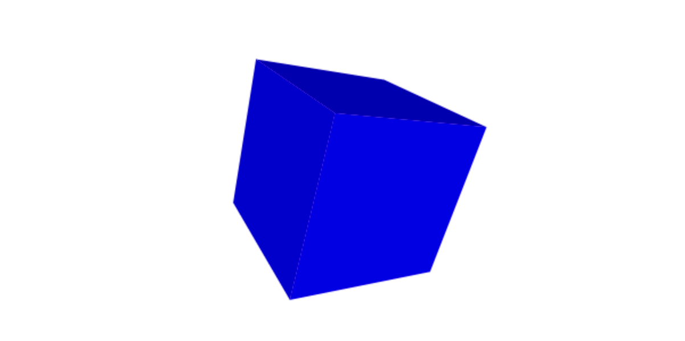
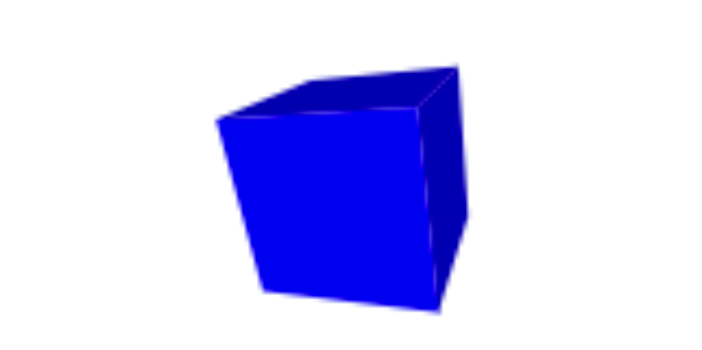

<div style="text-align:right; color:#aaa">Kristoffer Dyrkorn, May 4, 2024</div>

# Cubes, golfing and dual identities - part 2

<p align="center">

</p>

Here is part 2 of the article on cubes, golfing and dual identities. In this post we will look at how we can rewrite the app we made in part 1 so the source code becomes shorter. If you are wondering how this relates to golf, the answer is: Shortening source code to the absolute bare minimium is sometimes called code golfing.

In the previous post we created an app that shows a spinning cube on the screen. The app runs fine - so why would we shorten the code? It is normal practice to compress code and static resources to get good client-side performance, but here, performance is not the goal. The idea is rather to explore the many ways we can use a programming language to express functionality.

If we start with some snippet of code, and simplify the statements, reduce the structure and shorten everything as much as possible, while keeping the functionality as-is, what will remain? What are the differences between a down-to-the-metal, absolute bare minimum implementation - and a standard / "good practice" implementation, where aspects such as readability, maintainability, security are also important?

When we look at some source code, what elements are there to help us humans understanding it? How will it look like if we took all of that away?

Shortening - or compressing - code is also an exercise in figuring out what needs to be exact, and where we can use approximations to save space. We still need to check whether the result is precise enough. Since we are working with JavaScript, type coercion is part of the tool set. What can we gain from (mis-)using this language feature? JavaScript gives us a lot of flexibility, and the point here is to use that to explore the language in more detail.

Some may wonder what the value of this may be. I think golfing is an excellent opportunity to exercise creativety while programming. You will now have a completely different starting point - and goal - than you normally do when you write code. The notion of "optimal" is quite different from production code. In addition, you will learn a lot about the language you are working in - about its warts and rough egdes, but also the general strengths and weaknesses. You will get to know the various traps you can fall into. And, knowing the peculiarities of the language that is your primary tool in your everyday work is extremely valuable when the goal (usually, I guess) is to write correct, readable and efficient code.

First, two warnings: This will get pretty nerdy. And: The tricks mentioned here are not good programming practice.

Okay, let's begin. As mentioned, the goal is to save space. All tricks are allowed as long as the app still works - ie as long as the cube is drawn correctly and spins.

We first shorten all variable names, and drop the `var`. In other words, we don't care about strict mode.

```
p = [-1, -1, 1, 1, -1, 1, 1, 1, 1, -1, 1, 1, -1, -1, -1, 1, -1, -1, 1, 1, -1, -1, 1, -1];
r = [];
f = [0, 1, 2, 3, 0, 3, 7, 4, 0, 4, 5, 1, 6, 5, 4, 7, 6, 2, 1, 5, 6, 7, 3, 2];
```

We now look at the function that rotates the vertices. We know that we must rotate 8 vertices, each with x, y and z coordinates. That means we could proabaly rewrite the loop to iterate 24 times and save some indexing. We also reorganize the y rotation so we no longer need a temporary variable.

The function now looks like this:

```
function rotate(y, z) {
  for (i=0; i<24; i+=3) {
    r[i] = p[i] * Math.cos(z) - p[i+1] * Math.sin(z);
    r[i+1] = p[i] * Math.sin(z) + p[i+1] * Math.cos(z);
    r[i+2] = p[i+2] * Math.cos(y) - r[i] * Math.sin(y);
    r[i] = p[i+2] * Math.sin(y) + r[i] * Math.cos(y);
  }
}
```

In the same way, we update the function that calculates perspective:

```
function project(s, d) {
  for (i=0; i<24; i+=3) {
    r[i] = s * r[i] / (d - r[i+2]) + canvas.width/2;
    r[i+1] = -s * r[i+1] / (d - r[i+2]) + canvas.height/2;
  }
}
```

...and, the function that draws the cube:

```
function draw() {
  for (i=0; i<24; i+=4) {
    ctx.beginPath();
    ctx.moveTo(r[3*f[i]], r[3*f[i]+1]);
    s = r[3*f[i]+2];

    for (j=1; j<4; j++) {
      ctx.lineTo(r[3*f[i+j]], r[3*f[i+j]+1]);
      s += r[3*f[i+j]+2];
    }

    s = s / 4;

    ctx.closePath();
    ctx.fillStyle = colors[i/4];
    if (s > 0.15) {
      ctx.fill();
    }
  }
}
```

We have now shortened the [code](./app/2.html) a bit, it is 1678 bytes. It is compact, and less readable than before. Can we do more? Yes!

Let's start with a bit of a hack. Let's have a look at `rotate()` one more time. The function looked like this:

```
function rotate(y, z) {
  for (i=0; i<24; i+=3) {
    r[i] = p[i] * Math.cos(z) - p[i+1] * Math.sin(z);
    r[i+1] = p[i] * Math.sin(z) + p[i+1] * Math.cos(z);
    r[i+2] = p[i+2] * Math.cos(y) - r[i] * Math.sin(y);
    r[i] = p[i+2] * Math.sin(y) + r[i] * Math.cos(y);
  }
}
```

There are many calls to `Math.sin()` and `Math.cos()` here. They can be shortened. If you are into maths, you might remember that `sin(x)` is the same as `cos(x - PI/2)` if the angle is given in radians. At the same time, `sin(x)` is periodic, i.e. `sin(x)` equals `sin(x + n*2*PI)`. That means, `sin(x) = cos(x - PI/2) = cos(x - PI/2 + n*2*PI)`. Put differently: `sin(x)` can be expressed as `cos(x + "something")`. Is there a value for `"something"` that is very short? Let's start with `n=1` and see what happens:

```
-PI/2 + 1*2*PI = 4,712
-PI/2 + 2*2*PI = 10,995
```

The value 10.995 pops up! It is very close to 11, and this means that if we pretend that `sin(x)` is the same as `cos(x+11)` the error will be very small. If we also use an alias for `Math.cos()`, we will save even more space.

Here is the new version of the code:

```
m = Math.cos;

function rotate(y, z) {
  for (i=0; i<24; i+=3) {
    r[i] = p[i] * m(z) - p[i+1] * m(z+11);
    r[i+1] = p[i] * m(z+11) + p[i+1] * m(z);
    r[i+2] = p[i+2] * m(y) - r[i] * m(y+11);
    r[i] = p[i+2] * m(y+11) + r[i] * m(y);
  }
}
```

The function that calculates perspective looked like this:

```
function project(s, d) {
  for (i=0; i<24; i+=3) {
    r[i] = s * r[i] / (d - r[i+2]) + canvas.width/2;
    r[i+1] = -s * r[i+1] / (d - r[i+2]) + canvas.height/2;
  }
}
```

Here, the `for` loop has the same structure as `rotate(...)`, so we can just insert the contents of `project(...)` into it. At the same time, we change the method name and signature to `transform(y, z, s, d)`:

```
function transform(y, z, s, d) {
  for (i=0; i<24; i+=3) {
    r[i] = p[i] * m(z) - p[i+1] * m(z+11);
    r[i+1] = p[i] * m(z+11) + p[i+1] * m(z);
    r[i+2] = p[i+2] * m(y) - r[i] * m(y+11);
    r[i] = p[i+2] * m(y+11) + r[i] * m(y);
    r[i] = s * r[i] / (d - r[i+2]) + canvas.width/2;
    r[i+1] = -s * r[i+1] / (d - r[i+2]) + canvas.height/2;
  }
}
```

In the `draw()` function, the average z value of a surface decides whether it will be drawn or not. To save some space, we can use the sum of the z values instead. We also adjust the value we compare with accordingly - we multiply it by 4.

New code:

```
function draw() {
  for (i=0; i<24; i+=4) {
    ctx.beginPath();
    ctx.moveTo(r[3*f[i]], r[3*f[i]+1]);
    s = r[3*f[i]+2];

    for (j=1; j<4; j++) {
      ctx.lineTo(r[3*f[i+j]], r[3*f[i+j]+1]);
      s += r[3*f[i+j]+2];
    }

    ctx.closePath();
    ctx.fillStyle = colors[i/4];
    if (s > 0.6) {
      ctx.fill();
    }
  }
}
```

From now on we will also reuse the sum of the z values, to set the surface color. We save space by removing the table storing the predefined colors, and on top we get a simple lighting effect: the surface color will wary as if a light was placed at the camera.

To make the app run as before, we scale up the sum of z values so it fits the max RGB channel value of 255 in the Canvas API. We set the red and green channel values to zero and use the scaled z sum as the blue channel value.

The new drawing function looks like this:

```
function draw() {
  for (i=0; i<24; i+=4) {
    ctx.beginPath();
    ctx.moveTo(r[3*f[i]], r[3*f[i]+1]);
    s = r[3*f[i]+2];
    for (j=1; j<4; j++) {
      ctx.lineTo(r[3*f[i+j]], r[3*f[i+j]+1]);
      s += r[3*f[i+j]+2];
    }

    ctx.closePath();
    ctx.fillStyle = "rgb(0,0," + Math.trunc(127+s*32) + ")"
    if (s > 0.6) {
      ctx.fill();
    }
  }
}
```

The [code](./app/3.html) is now 1522 bytes and is starting to become unreadable. The cube still looks fine:

<p align="center">

</p>

It is time for more drastic improvements. We put all the code into `animate()`, insert the scaling and perspective constants directly into the calculations, and use a shared variable `v` for the rotation angles of both the y and z axes. That means the cube's rotation speed will be the same for both axes, but we choose to accept that tradeoff. We store m(x) and m(x+11) in variables as well so they can be reused to save space.

```
function animate() {
  requestAnimationFrame(animate);

  ctx.clearRect(0, 0, canvas.width, canvas.height);

  for (i=0; i<24; i+=3) {
    u = m(v+11);
    o = m(v);
    r[i] = p[i] * o - p[i+1] * u;
    r[i+1] = p[i] * u + p[i+1] * o;
    r[i+2] = p[i+2] * o - r[i] * u;
    r[i] = p[i+2] * u + r[i] * o;
    r[i] = 350 * r[i] / (5 - r[i+2]) + canvas.width/2;
    r[i+1] = -350 * r[i+1] / (5 - r[i+2]) + canvas.height/2;
  }

  for (i=0; i<24; i+=4) {
    ctx.beginPath();
    ctx.moveTo(r[3*f[i]], r[3*f[i]+1]);
    s = r[3*f[i]+2];

    for (j=1; j<4; j++) {
      ctx.lineTo(r[3*f[i+j]], r[3*f[i+j]+1]);
      s += r[3*f[i+j]+2];
    }
    ctx.closePath();
    ctx.fillStyle = "rgb(0,0," + Math.trunc(127+s*32) + ")"
    if (s > 0.6) {
      ctx.fill();
    }
  }

  v += .018;
}
```

We now remove all HTML that is not absolutely necessary. There is actually quite a lot that can be deleted. We also remove the semicolons and some whitespace, but choose to keep some whitespace around to make it easier to keep working with the code. We also shorten the names of the remaining variables.

The [code](./app/4.html) is now down to 1159 bytes.

It's time to try to improve the `for` loops. Can we increase `i` inside the loop bodies themselves to save some space? After some changes, `animate(...)` looks like this:

```
function animate() {
  requestAnimationFrame(animate)
  a.clearRect(0,0,c.width,c.height)
  for(i=0;i<24;i++) {
    u=m(v+11)
    o=m(v)
    r[i]=p[i]*o-p[i+1]*u
    r[i+1]=p[i]*u+p[i+1]*o
    r[i+2]=p[i+2]*o-r[i]*u
    r[i]=p[i+2]*u+r[i]*o
    r[i]=350*r[i]/(5-r[++i+1])+c.width/2
    r[i]=350*r[i]/(5-r[++i])+c.height/2
  }
  for(i=0;i<24;i++) {
    a.beginPath()
    a.moveTo(r[3*f[i]],r[3*f[i]+1])
    s=r[3*f[i]+2]
    for(j=3;j--;) {
      s+=r[3*f[++i]+2]
      a.lineTo(r[3*f[i]],r[3*f[i]+1])
    }
    a.closePath()
    a.fillStyle="rgb(0,0,"+(127+s*32|0)+")"
    .6<s&&a.fill()
  }
  v+=.02
}
```

We have now changed two of the `for` loops by using `++i` and `i++` inside the loop bodies. We have also replaced `Math.trunc()` with `|0` (yes, it actually gives the same result). We have also changed the sign of the negative scaling factor - to save space. This means the cube will now be drawn upside down, but since the cube is symmetric there will be no visible difference. We also use short circuit evaluation to replace the `if` statement with an `&&`, and we save one more character by slightly increasing the rotation speed.

The [code](./app/5.html) is now 1103 bytes.

There is even more to be done! Let's take a look at how we set the size of the canvas element. We can use CSS instead of JavaScript - and then we then no longer need to refer to `window.innerWidth` and `window.innerHeight`:

```
<canvas id=c style=width:99%><script>
v=0
m=Math.cos
a=c.getContext("2d")
(...)
```

By using CSS here, the surface we are drawing on will be scaled up. This means that each pixel in the canvas will become larger, i.e. the canvas resolution goes down. It can be discussed whether this change means we keep the cube as is - but we choose to accept it.

The scaling factor that determinces the cube size is reduced a bit since each pixel now is larger. This saves a character. We also store the width of the canvas in a variable `w`, and reuse it across the code, to shorten things. Since an open browser window likely will have a height-to-width ratio of around 1:1, we can use the `w` value as a starting point for the window height as well.

The cube now looks like this:

<p align="center">

</p>

The changes in the code are shown here:

```
w=c.width

function animate() {
  requestAnimationFrame(animate)
  a.clearRect(0,0,w,w)
  for(i=0;i<24;i++) {
    u=m(v+11)
    o=m(v)
    r[i]=p[i]*o-p[i+1]*u
    r[i+1]=p[i]*u+p[i+1]*o
    r[i+2]=p[i+2]*o-r[i]*u
    r[i]=p[i+2]*u+r[i]*o
    r[i]=99*r[i]/(5-r[++i+1])+w/2
    r[i]=99*r[i]/(5-r[++i])+w/3
  }
  (...)
```

At this stage, it is time to do something with the surface definitions (the vertex array). We shorten the `f`-array by putting the numbers in a string that we send to `String.split(“”)`. The output is the exact same array as before. We use another trick - we replace the `("")` with `` to save space.

```
f="012303740451654762156732".split``
```

[The code](./app/6.html) is 783 bytes now.

We will skip changing the coordinate array now - but there are still more things to do! We can send all the code in `animate()` (ie everything but the `requestAnimationFrame()` call) to [Google's Closure compiler](https://closure-compiler.appspot.com/) and make it do some work for us: What happens if we use the "Advanced optimizations" it can offer?

The code returned is:

```
a.clearRect(0,0,w,w);for(i=0;24>i;i++)u=m(v+11),o=m(v),r[i]=p[i]*o-p[i+1]*u,r[i+1]=p[i]*u+p[i+1]*o,r[i+2]=p[i+2]*o-r[i]*u,r[i]=p[i+2]*u+r[i]*o,r[i]=99*r[i]/(5-r[++i+1])+w/2,r[i]=99*r[i]/(5-r[++i])+w/3;for(i=0;24>i;i++){a.beginPath();a.moveTo(r[3*f[i]],r[3*f[i]+1]);s=r[3*f[i]+2];for(j=3;j--;)s+=r[3*f[++i]+2],a.lineTo(r[3*f[i]],r[3*f[i]+1]);a.closePath();a.fillStyle="rgb(0,0,"+(127+32*s|0)+")";.6<s&&a.fill()}v+=.02;
```

Let's use this code. We change the animation loop from using `requestAnimationFrame()` to using `setInterval(...)`. One version of the `setInterval(...)` function can take the code to execute (in a text string) as the first parameter, and the interval between each execution (as a number), as the second. We set the interval time to 9 ms, and turn down the rotation speed a bit, so the cube looks the same as before.

To sum up, we change from:

```
function animate() {
  requestAnimationFrame(animate)

  <code>
}
animate()
```

...to:

```
setInterval('<code>', 9)
```

This will make the animation less smooth, but we choose to accept that.

The entire application now looks like this:

```
<canvas id=c style=width:99%><script>
v=0
a=c.getContext`2d`
w=c.width
m=Math.cos
p=[-1,-1,1,1,-1,1,1,1,1,-1,1,1,-1,-1,-1,1,-1,-1,1,1,-1,-1,1,-1]
f="012303740451654762156732".split``
r=[]
setInterval('a.clearRect(0,0,w,w);for(i=0;24>i;i++)u=m(v+11),o=m(v),r[i]=p[i]*o-p[i+1]*u,r[i+1]=p[i]*u+p[i+1]*o,r[i+2]=p[i+2]*o-r[i]*u,r[i]=p[i+2]*u+r[i]*o,r[i]=99*r[i]/(5-r[++i+1])+w/2,r[i]=99*r[i]/(5-r[++i])+w/3;for(i=0;24>i;i++){a.beginPath();a.moveTo(r[3*f[i]],r[3*f[i]+1]);s=r[3*f[i]+2];for(j=3;j--;)s+=r[3*f[++i]+2],a.lineTo(r[3*f[i]],r[3*f[i]+1]);a.closePath();a.fillStyle="rgb(0,0,"+(127+32*s|0)+")";.6<s&&a.fill()}v+=.01;',9)</script>
```

We remove the remaining line breaks, and get:

```
<canvas id=c style=width:99%><script>v=0;a=c.getContext`2d`;w=c.width;m=Math.cos;p=[-1,-1,1,1,-1,1,1,1,1,-1,1,1,-1,-1,-1,1,-1,-1,1,1,-1,-1,1,-1];f="012303740451654762156732".split``;r=[];setInterval('a.clearRect(0,0,w,w);for(i=0;24>i;i++)u=m(v+11),o=m(v),r[i]=p[i]*o-p[i+1]*u,r[i+1]=p[i]*u+p[i+1]*o,r[i+2]=p[i+2]*o-r[i]*u,r[i]=p[i+2]*u+r[i]*o,r[i]=99*r[i]/(5-r[++i+1])+w/2,r[i]=99*r[i]/(5-r[++i])+w/3;for(i=0;24>i;i++){a.beginPath();a.moveTo(r[3*f[i]],r[3*f[i]+1]);s=r[3*f[i]+2];for(j=3;j--;)s+=r[3*f[++i]+2],a.lineTo(r[3*f[i]],r[3*f[i]+1]);a.closePath();a.fillStyle="rgb(0,0,"+(127+32*s|0)+")";.6<s&&a.fill()}v+=.01',9)</script>
```

[The whole app](./app/7.html) is now 630 bytes! Phew!

We have now reached a point where there is not that much more that can be done. There are probably a few more bytes that can be squeezed out, but the geek level here is already quite high.

Nevertheless: One more trick remains. It relies on data compression - and the way a browser reads and parses data. The great news is that we will make the browser do all the hard work for us. Go to the next part and find out more!

But first: To learn some more code-minifying tricks in JavaScript, have a look [here](https://github.com/jed/140bytes/wiki/Byte-saving-techniques) and [here](https://slides.com/pdesch/js-demoscene-techniques). Also, the website of Mathieu Henri, aka [p01](http://www.p01.org/), is a must.
