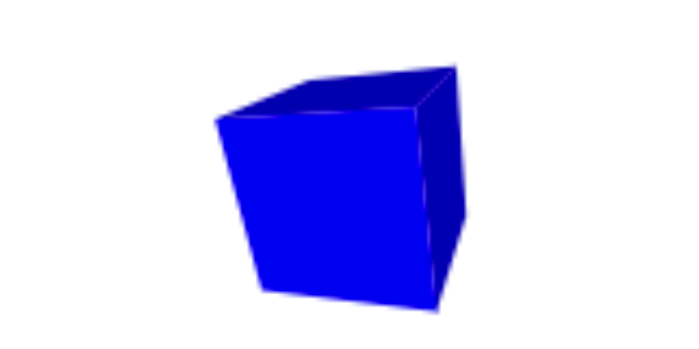

<div style="text-align:right; color:#aaa">Kristoffer Dyrkorn, May 4, 2024</div>

# Cubes, golfing and dual identities - part 2

<p align="center">

</p>

Here is part 2 of the article on cubes, golf and dual identities. In this post we will look at how we can rewrite the app we made in the first post so the source code becomes shorter. If you are wondering how this relates to golf, the answer is: Solving a given problem using the shortest amount code is called code golfing.

In the previous post we created an app that animates a cube. We will now make the code shorter. Why is this interesting? When you are making a web app it is important to compress the code and the static resources so the app loads quickly - ie so you get good client-side performance. However, here, high performance is not the goal. The point is rather to explore the freedom we can have - inside a programming language - to expressing ourselves in various ways.

If we start with some snippet of code, and simplify the statements, reduce the structure and shorten everything as much as possible - while keeping the functionality as it is, what will we have left? What is the difference between the absolute bare minimum of source code that is needed to make a program run and do things, and a standard / common piece of source code that typically will follow a set of conventions - for example to ensure readability, maintainability, security and so on?

When we look at some program code, what has been added to help us humans in understanding it? How does the source code (ie the languate) look like, if we take all of that away?

Compression is also an exercise in figuring out which parts of the code that needs to be exact. Can we save space by using approximations? Will the result still be good enough? Since we are working with JavaScript here, we cannot avoid mentioning type coercion. What opportunities do we get from (mis-)using this? JavaScript gives us a lot of flexibility and it can be interesting to use that to explore the language in detail.

Some may wonder what the value of doing that may be. I think this is an excellent opportunity to exercise creativety while programming. You will now write code with a completely different starting point - and goal - than you normally do. What "optimal" means in this context, is quite different from production code. In addition, you gain a lot of knowledge about the language you are working in, about the warts and rough egdes it contains, and the strengths and weaknesses it has. You will also learn more about the various traps you can fall into. Knowing the peculiarities of the language that is your primary tool is extremely valuable when your primary goal (presumably) is to write correct, readable and efficient code.

First, two warnings: This will get pretty nerdy. And: The tricks presented here are not good programming practice. But, if you want to learn more about JavaScript triks, see the links at the end of this post.

Okay, let's begin. As previously mentioned, the goal is to save space. All tricks are allowed as long as the app still works - ie the cube is drawn correctly and spins.

We first shorten the names of all variables, and drop the `var`. In other words, we don't care about strict mode.

```
p = [-1, -1, 1, 1, -1, 1, 1, 1, 1, -1, 1, 1, -1, -1, -1, 1, -1, -1, 1, 1, -1, -1, 1, -1];
r = [];
f = [0, 1, 2, 3, 0, 3, 7, 4, 0, 4, 5, 1, 6, 5, 4, 7, 6, 2, 1, 5, 6, 7, 3, 2];
```

We then look at the function that rotates the vertices around the z and y axes. We know that we must rotate 8 vertices, each with x, y and z coordinates. That means we could rewrite the loop to iterate 24 times. By reorganizing the y rotation section we no longer need to use a temporary variable there.

The function now looks like this:

```
function rotate(y, z) {
  for (i=0; i<24; i+=3) {
    r[i] = p[i] * Math.cos(z) - p[i+1] * Math.sin(z);
    r[i+1] = p[i] * Math.sin(z) + p[i+1] * Math.cos(z);
    r[i+2] = p[i+2] * Math.cos(y) - r[i] * Math.sin(y);
    r[i] = p[i+2] * Math.sin(y) + r[i] * Math.cos(y);
  }
}
```

We also update the function that calculates perspective in the same way:

```
function project(s, d) {
  for (i=0; i<24; i+=3) {
    r[i] = s * r[i] / (d - r[i+2]) + canvas.width/2;
    r[i+1] = -s * r[i+1] / (d - r[i+2]) + canvas.height/2;
  }
}
```

...and, the function that draws the cube:

```
function draw() {
  for (i=0; i<24; i+=4) {
    ctx.beginPath();
    ctx.moveTo(r[3*f[i]], r[3*f[i]+1]);
    s = r[3*f[i]+2];

    for (j=1; j<4; j++) {
      ctx.lineTo(r[3*f[i+j]], r[3*f[i+j]+1]);
      s += r[3*f[i+j]+2];
    }

    s = s / 4;

    ctx.closePath();
    ctx.fillStyle = colors[i/4];
    if (s > 0.15) {
      ctx.fill();
    }
  }
}
```

We have now shortened the code a bit, it is 1581 bytes. It is compact, and not very readable anymore. Can we do more? Yes!

We start with a dark hack. Hold on tight! Let's have a look at `rotate()` one more time. The function looked like this:

```
function rotate(y, z) {
  for (i=0; i<24; i+=3) {
    r[i] = p[i] * Math.cos(z) - p[i+1] * Math.sin(z);
    r[i+1] = p[i] * Math.sin(z) + p[i+1] * Math.cos(z);
    r[i+2] = p[i+2] * Math.cos(y) - r[i] * Math.sin(y);
    r[i] = p[i+2] * Math.sin(y) + r[i] * Math.cos(y);
  }
}
```

There are many calls to `Math.sin()` and `Math.cos()` here. They can be simplified a bit. If you are into maths, you might remember that `sin(x)` can be written as `cos(x - PI/2)` if angles are given in radians. At the same time, `sin(x)` is periodic, i.e. `sin(x)` will always be equal to `sin(x + n*2*PI)`. That means, `sin(x) = cos(x - PI/2) = cos(x - PI/2 + n*2*PI)`. Put another way: `sin(x)` can be expressed as `cos(x + "something")`. Is there a value for `"something"` that takes up very little space? Let's start with `n=1` and see how things look like:

```
-PI/2 + 1*2*PI = 4,712
-PI/2 + 2*2*PI = 10,995
```

The value 10.995 looks very nice! It is close to 11, so the error from using 11 instead will be very small if we pretend that `sin(x)` is the same as `cos(x+11)`. If we also introduce an alias for `Math.cos()`, we will even more benefits out of this.

Here is the code after an update:

```
m = Math.cos;

function rotate(y, z) {
  for (i=0; i<24; i+=3) {
    r[i] = p[i] * m(z) - p[i+1] * m(z+11);
    r[i+1] = p[i] * m(z+11) + p[i+1] * m(z);
    r[i+2] = p[i+2] * m(y) - r[i] * m(y+11);
    r[i] = p[i+2] * m(y+11) + r[i] * m(y);
  }
}
```

The function that calculates perspective looked like this:

```
function project(s, d) {
  for (i=0; i<24; i+=3) {
    r[i] = s * r[i] / (d - r[i+2]) + canvas.width/2;
    r[i+1] = -s * r[i+1] / (d - r[i+2]) + canvas.height/2;
  }
}
```

Here, the `for` loop has the same structure as `rotate(...)`, so we can insert the contents of `project(...)` there. At the same time, we then change the method name and signature to `transform(y, z, s, d)`:

```
function transform(y, z, s, d) {
  for (i=0; i<24; i+=3) {
    r[i] = p[i] * m(z) - p[i+1] * m(z+11);
    r[i+1] = p[i] * m(z+11) + p[i+1] * m(z);
    r[i+2] = p[i+2] * m(y) - r[i] * m(y+11);
    r[i] = p[i+2] * m(y+11) + r[i] * m(y);
    r[i] = s * r[i] / (d - r[i+2]) + canvas.width/2;
    r[i+1] = -s * r[i+1] / (d - r[i+2]) + canvas.height/2;
  }
}
```

In the `draw()` function, we use the average of the z coordinates of a surface to decide whether to draw it or not. To save some space, we might as well use the sum of the z coordinates instead of the average. This will work as long as we also adjust the value we compare with (in this case: we need to multiply it by 4).

New code:

```
function draw() {
  for (i=0; i<24; i+=4) {
    ctx.beginPath();
    ctx.moveTo(r[3*f[i]], r[3*f[i]+1]);
    s = r[3*f[i]+2];

    for (j=1; j<4; j++) {
      ctx.lineTo(r[3*f[i+j]], r[3*f[i+j]+1]);
      s += r[3*f[i+j]+2];
    }

    ctx.closePath();
    ctx.fillStyle = colors[i/4];
    if (s > 0.6) {
      ctx.fill();
    }
  }
}
```

We can use the sum of the z values for something else as well: To change the color of the surface. We can replace the fixed surface colors and achieve a simple lighting effect.

For a visible surface, the sum of the z values will lie between 0.6 and 4. We can scale up value so it can be used directly as an RGB value when specifying the color. We set the red and green channel values to 0, and we let the sum indicate the blue channel value. (The upscaling is done so the maximum blue channel value becomes 255.) Since the surface colors are now calculated, we remove the array that stored the colors — and thus save space.

The new drawing function looks like this:

```
function draw() {
  for (i=0; i<24; i+=4) {
    ctx.beginPath();
    ctx.moveTo(p[3*f[i]], p[3*f[i]+1]);
    s = p[3*f[i]+2];
    for (j=1; j<4; j++) {
      ctx.lineTo(p[3*f[i+j]], p[3*f[i+j]+1]);
      s += p[3*f[i+j]+2];
    }

    ctx.closePath();
    ctx.fillStyle = "rgb(0,0," + Math.trunc(127+s*32) + ")"
    if (s > 0.6) {
      ctx.fill();
    }
  }
}
```

The code is now 1443 bytes and is starting to become unreadable. The cube still looks fine:

<p align="center">

</p>

It is time for more drastic action. We put all the code into `animate()`, insert constants directly into the perspective calculations, and use a shared variable to store the rotation angle for both the y and z axes. That means we will slightly change the way the cube rotates (the rotation speed will be equal for both axes), but we will accept that trade-off. We put the values for m(x) and m(x+11) into variables as well, and reuse those in the rotation code.

```
function animate() {
  requestAnimationFrame(animate);

  ctx.clearRect(0, 0, canvas.width, canvas.height);

  for (i=0; i<24; i+=3) {
    u = m(v+11);
    o = m(v);
    r[i] = p[i] * o - p[i+1] * u;
    r[i+1] = p[i] * u + p[i+1] * o;
    r[i+2] = p[i+2] * o - r[i] * u;
    r[i] = p[i+2] * u + r[i] * o;
    r[i] = 350 * r[i] / (5 - r[i+2]) + canvas.width/2;
    r[i+1] = -350 * r[i+1] / (5 - r[i+2]) + canvas.height/2;
  }

  for (i=0; i<24; i+=4) {
    ctx.beginPath();
    ctx.moveTo(r[3*f[i]], r[3*f[i]+1]);
    s = r[3*f[i]+2];

    for (j=1; j<4; j++) {
      ctx.lineTo(r[3*f[i+j]], r[3*f[i+j]+1]);
      s += r[3*f[i+j]+2];
    }
    ctx.closePath();
    ctx.fillStyle = "rgb(0,0," + Math.trunc(127+s*32) + ")"
    if (s > 0.6) {
      ctx.fill();
    }
  }

  v += .018;
}
```

We now remove all the markup that is not _strictly_ necessary. There is actually quite a lot that can be deleted. We also remove the semicolon and some whitespace, but choose to keep some whitespace around to make it easier to keep working on the code. We also shorten the names of the remaining variables.

The code is now down to 847 bytes.

It's time to try to improve the `for` loops. Can we increase `i` inside the loop bodies themselves to save some space? After some changes, `animate(...)` looks like this:

```
function animate() {
  requestAnimationFrame(animate)
  a.clearRect(0,0,c.width,c.height)
  for(i=0;i<24;i++) {
    u=m(v+11)
    o=m(v)
    r[i]=p[i]*o-p[i+1]*u
    r[i+1]=p[i]*u+p[i+1]*o
    r[i+2]=p[i+2]*o-r[i]*u
    r[i]=p[i+2]*u+r[i]*o
    r[i]=350*r[i]/(5-r[++i+1])+c.width/2
    r[i]=350*r[i]/(5-r[++i])+c.height/2
  }
  for(i=0;i<24;i++) {
    a.beginPath()
    a.moveTo(r[3*f[i]],r[3*f[i]+1])
    s=r[3*f[i]+2]
    for(j=3;j--;) {
      s+=r[3*f[++i]+2]
      a.lineTo(r[3*f[i]],r[3*f[i]+1])
    }
    a.closePath()
    a.fillStyle="rgb(0,0,"+(127+s*32|0)+")"
    .6<s&&a.fill()
  }
  v+=.02
}
```

We have now changed two of the `for` loops by using `++i` and `i++` inside the loop bodies. We have also replaced `Math.trunc()` with `|0` (yes, it actually gives the same result). We have also removed the negative scaling factor. The cube will now be drawn upside down compared to before, but since the cube is symmetric there will be no visible differences. We also use short circuit evaluation to replace the `if` statement with an `&&`, and we save one more character by slightly increasing the rotation speed.

The code is now 810 bytes.

There is even more to be done! We can take a look at how we set the size of the canvas element. We can use CSS instead of JavaScript, and then we then no longer need to read out `window.innerWidth` and `window.innerHeight`:

```
<canvas id=c style=width:99%><script>
v=0
m=Math.cos
a=c.getContext("2d")
(...)
```

By using CSS here, the surface we are drawing on will be scaled up. This means that each pixel in the canvas will become larger, i.e. the resolution goes down. It can be discussed whether this change is within the rules - but we choose to accept it.

The scaling factor that determinces the cube size needs to be reduced a bit since each pixel now is larger. We also store the width of the canvas in a variable `w`, and reuse it to shorten things. Since most people look at browser windows having a height-to-width ratio of approximately 1:1, we can also use the `w` value as a starting point when specifying window height.

The cube now looks like this:

<p align="center">

</p>

The changes in the code are shown here:

```
w=c.width

function animate() {
  requestAnimationFrame(animate)
  a.clearRect(0,0,w,w)
  for(i=0;i<24;i++) {
    u=m(v+11)
    o=m(v)
    r[i]=p[i]*o-p[i+1]*u
    r[i+1]=p[i]*u+p[i+1]*o
    r[i+2]=p[i+2]*o-r[i]*u
    r[i]=p[i+2]*u+r[i]*o
    r[i]=99*r[i]/(5-r[++i+1])+w/2
    r[i]=99*r[i]/(5-r[++i])+w/3
  }
  (...)
```

At this stage, it is time to do something with the definitions of the coordinates and surfaces. We shorten the `f`-array by putting the numbers in a string that we send to `String.split(“”)` to create the exact same array as before:

```
f="012303740451654762156732".split("")
```

We are at 741 bytes now.

We will not change the other array, the `p`-array, at this point. There are still more things to do: We can send all the code in `animate()` (ie everything except the `requestAnimationFrame()` call itself) to [Google's Closure compiler](https://closure-compiler.appspot.com/) and make it do some work for us: What happens if we use the "Advanced optimizations" it can offer?

The code returned is:

```
a.clearRect(0,0,w,w);for(i=0;24>i;i++)u=m(v+11),o=m(v),r[i]=p[i]*o-p[i+1]*u,r[i+1]=p[i]*u+p[i+1]*o,r[i+2]=p[i+2]*o-r[i]*u,r[i]=p[i+2]*u+r[i]*o,r[i]=99*r[i]/(5-r[++i+1])+w/2,r[i]=99*r[i]/(5-r[++i])+w/3;for(i=0;24>i;i++){a.beginPath();a.moveTo(r[3*f[i]],r[3*f[i]+1]);s=r[3*f[i]+2];for(j=3;j--;)s+=r[3*f[++i]+2],a.lineTo(r[3*f[i]],r[3*f[i]+1]);a.closePath();a.fillStyle="rgb(0,0,"+(127+32*s|0)+")";.6<s&&a.fill()}v+=.02;
```

We now change the animation loop from using `requestAnimationFrame()` to using `setInterval(...)`. The `setInterval(...)` function can accept two parameters - the code to execute (in a text string), and the interval between each execution (in a number). We set the interval to 9 ms, and turn down the rotation speed a bit, to make the cube spin with the same speed as before.

To sum up, we change from:

```
function animate() {
  requestAnimationFrame(animate)

  <kode>
}
animate()
```

...to:

```
setInterval('<code>', 9)
```

This will make the animation less smooth, but we choose to accept that.

The entire application now looks like this:

```
<canvas id=c style=width:99%><script>
v=0
a=c.getContext("2d")
w=c.width
m=Math.cos
p=[-1,-1,1,1,-1,1,1,1,1,-1,1,1,-1,-1,-1,1,-1,-1,1,1,-1,-1,1,-1]
f="012303740451654762156732".split("")
r=[]
setInterval('a.clearRect(0,0,w,w);for(i=0;24>i;i++)u=m(v+11),o=m(v),r[i]=p[i]*o-p[i+1]*u,r[i+1]=p[i]*u+p[i+1]*o,r[i+2]=p[i+2]*o-r[i]*u,r[i]=p[i+2]*u+r[i]*o,r[i]=99*r[i]/(5-r[++i+1])+w/2,r[i]=99*r[i]/(5-r[++i])+w/3;for(i=0;24>i;i++){a.beginPath();a.moveTo(r[3*f[i]],r[3*f[i]+1]);s=r[3*f[i]+2];for(j=3;j--;)s+=r[3*f[++i]+2],a.lineTo(r[3*f[i]],r[3*f[i]+1]);a.closePath();a.fillStyle="rgb(0,0,"+(127+32*s|0)+")";.6<s&&a.fill()}v+=.01;',9)</script>
```

We remove the remaining line breaks, and get, finally:

```
<canvas id=c style=width:99%><script>v=0;a=c.getContext("2d");w=c.width;m=Math.cos;p=[-1,-1,1,1,-1,1,1,1,1,-1,1,1,-1,-1,-1,1,-1,-1,1,1,-1,-1,1,-1];f="012303740451654762156732".split("");r=[];setInterval('a.clearRect(0,0,w,w);for(i=0;24>i;i++)u=m(v+11),o=m(v),r[i]=p[i]*o-p[i+1]*u,r[i+1]=p[i]*u+p[i+1]*o,r[i+2]=p[i+2]*o-r[i]*u,r[i]=p[i+2]*u+r[i]*o,r[i]=99*r[i]/(5-r[++i+1])+w/2,r[i]=99*r[i]/(5-r[++i])+w/3;for(i=0;24>i;i++){a.beginPath();a.moveTo(r[3*f[i]],r[3*f[i]+1]);s=r[3*f[i]+2];for(j=3;j--;)s+=r[3*f[++i]+2],a.lineTo(r[3*f[i]],r[3*f[i]+1]);a.closePath();a.fillStyle="rgb(0,0,"+(127+32*s|0)+")";.6<s&&a.fill()}v+=.01',9)</script>
```

This is 633 bytes! Phew! We have now reached a point where there is not that much that can be done with the source code itself. There are probably a few more bytes that can be squeezed out, but we've already geeked out quite a bit here.

Nevertheless: There is one more great trick we can use. This one relies on data compression, and by exploiting the way a browser reads data we make it do all the hard work for us. Part 3 of this blog post will give you all the details.

But first: [Here](https://github.com/jed/140bytes/wiki/Byte-saving-techniques) and [here](https://slides.com/pdesch/js-demoscene-techniques) you will find some more tricks that can be used to shorten JavaScript code. The website of Mathieu Henri, aka [p01](http://www.p01.org/), is an absolute must.
