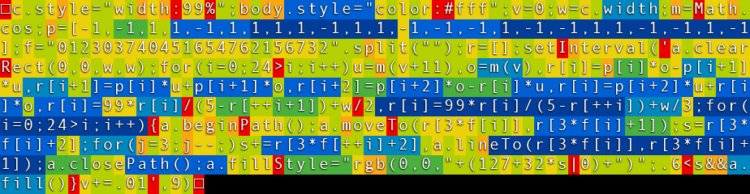
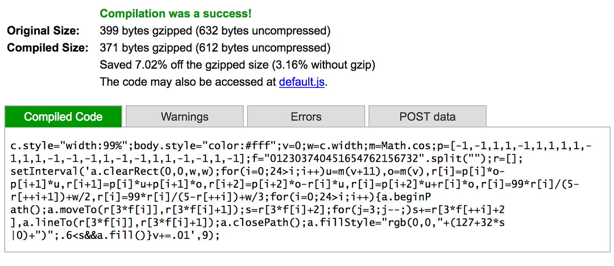

<div style="text-align:right; color:#aaa">Kristoffer Dyrkorn, May 4, 2024</div>

# Cubes, golfing and dual identities - part 3

_Note: This is a translation of an article I wrote in 2016._

So far in this article series, we have [created a small web app](./) and [refactored the source code](./2) to minimize the size. Here, in part 3, we will compress the code even more by playing tricks with the browser.

When web servers send responses to browsers, the data is often compressed using some lossless compression algorithm (for example, Deflate). This reduces the bandwidth need and the download time. It is usually the web server's responsibility to compress the response data, and the browser is responsible for doing the decompression so the actual data can be read and processed as normal. The Deflate algorithm is widely used and also supported by all browsers out there. Depending on how the input looks like it can reduce normal text (or HTML, CSS or JavaScript) to about one third of the original size.

It would be interesting to run our code from [part 2](./2) through a compression algorithm and see what we get. The question is: How? We don't want to rely on a web server here - the source code should stay completely self-contained. So we have to come up with something else.

Fortunately, someone has already come up with something else! [Cody Brocious](https://github.com/daeken/Benjen/blob/master/daeken.com/entries/superpacking-js-demos.md), aka Daeken, has found a way to further compress the code.

Let's take a closer look at the various data formats supported by browsers. Image files is one of them. And, some image formats (including PNG), support lossless compression schemes - including the Deflate algorithm. When decoding an image, the browser needs to decompress the data - and this happens completely transparently for us. so the browser knows how to do this already. But then the question becomes: Can we somehow package our code in a PNG? Is that even possible? Will it work?

Yes, it works! Although code is text, code is also just byte values - just like the RGB color values in an image. So we can encode our source code as a sequence of bytes (by taking the ASCII value of each character), and then send the byte array to a PNG encoder. The output is an image that does not contain anything visually pleasing, but it does contain a Deflate-compressed version of our source code.

The next question becomes: How can we decompress that image, convert the bytes into text (source code), and then run the app? This where the notion of dual identities comes in. The PNG format supports so-called "custom chunks", which are metadata blocks inside a PNG that you can fill with whatever you want - including text. This means, we can fill such a block with HTML and JavaScript if we want to.

If we rename a PNG, so it gets the file extension `.html`, and try to open it in a browser, the browser will assume the file contains HTML. The browser will not understand the contents (PNG data), but, as the standard tells it to, the browser will ignore this and keep on reading. Then, when the browser sees the start of our custom PNG chunk, it will recognize it as HTML (and JavaScript), and read in and execute that code. So, the trick here is to put a small JavaScript decoder in the custom chunk. The decoder will read the byte values out from the PNG, translate the byte array into ASCII text, and then execute the text - ie the source code of our app.

To sum up, the procedure is:

- Start with the source code for the web app
- Convert the source code (ie text) into a byte array and create a PNG out of the byte array
- Create an decoder and app runner in JavaScript, and put it in the PNG, inside a custom chunk
- Rename the resulting PNG so it has the file extension `.html`

There are [ready-made generator scripts](https://gist.github.com/gasman/2560551) out there that can to this for us.

When the browser processes the file, this happens:

- The browser thinks the file contains HTML, but initially sees binary data, so the data is ignored and it keeps reading
- The browser reaches the decoder, recognizes it as valid code, parses it and runs it
- The decoder points back to the image data at the beginning of the file, and makes the browser read it in again and decompress it for us
- The decoder converts the output - each color value (each byte) of the pixels in the image - to a sequence of characters, treats that text as source code, and executes it

Thus we have compressed the source code using Deflate compression without introducing a server or code to do explicitly do decompression. We rely on built-in browser features to handle image formats to do this. We also use a file with dual identities: The app is both a PNG file and an HTML page containing JavaScript!

Let's see how this looks like in practice. We start with the decoder. It needs to be as compact as possible - and do as little as possible - since it will be stored uncompressed in the custom chunk inside the PNG. The decoder needs a canvas to get access to the pixels in the image, so we add markup for that in the decoder. At the same time, we can reuse the `canvas` element in the application itself. Let's start with an existing decoder that is quite compact, and then set the width to 99% as we have done before. It looks like this:

```
<canvas id=c style=width:99%>
```

Both the canvas element `c` and the graphics context `a` will be available for the app as well, so we don't need to initialize those in the app. The main code for the app - ie, the code we are going to turn into a PNG - can be simplified a bit, to this:

```
v=0;w=c.width;m=Math.cos;p=[-1,-1,1,1,-1,1,1,1,1,-1,1,1,-1,-1,-1,1,-1,-1,1,1,-1,-1,1,-1];f="012303740451654762156732".split``;r=[];setInterval('a.clearRect(0,0,w,w);for(i=0;24>i;i++)u=m(v+11),o=m(v),r[i]=p[i]*o-p[i+1]*u,r[i+1]=p[i]*u+p[i+1]*o,r[i+2]=p[i+2]*o-r[i]*u,r[i]=p[i+2]*u+r[i]*o,r[i]=99*r[i]/(5-r[++i+1])+w/2,r[i]=99*r[i]/(5-r[++i])+w/3;for(i=0;24>i;i++){a.beginPath();a.moveTo(r[3*f[i]],r[3*f[i]+1]);s=r[3*f[i]+2];for(j=3;j--;)s+=r[3*f[++i]+2],a.lineTo(r[3*f[i]],r[3*f[i]+1]);a.closePath();a.fillStyle="rgb(0,0,"+(127+32*s|0)+")";.6<s&&a.fill()}v+=.01',9)
```

If we run this through the generator script, the output is 555 bytes! However, we see some strange characters at the top of the screen. This happens because the image file, mainly consisting of binary data that are ignored, also will have some byte values inside the ASCII range containing letters Those letters will be printed on the screen. One way to get out of that is to hide that text using CSS - we'll just add some JavaScript at the start of the app that will make the text color white:

```
body.style="color:#fff";v=0;w=c.width;m=Math.cos;(...)
```

The CSS we added to the decoder can instead be placed inside the application so it will be run through the compressor.

```
c.style="width:99%";body.style="color:#fff";v=0;w=c.width;m=Math.cos;(...)
```

With these changes in place, the code is 564 bytes. Not bad! The previous version of the app was 630 bytes, so introducing compression resulted in a net gain of 66 bytes although the decoder that had to be added was 154 bytes long.

It would be interesting to know more about the compression ratio. How well does the various parts of the source code actually compress? Which parts are close to uncompressable? Maybe they could be rewritten? Since the app itself is quite small the compressor does not have much data to work on. This means that if we write more code, the compressed output might still become smaller if the new source code contains more common substrings than before. Refactoring to optimize for compressibility sounds fun, but is complicated!

Fortunately, there is a tool that can help us do that. A program called `gzthermal` can produce a color plot where we see how much space each source code character takes when compressed. The scale indicates - from red (a little), via orange, yellow, green to blue (a lot) - how well each character is compressed. If we run `gzthermal` on our app, the output looks like this:

<p align="center">

</p>

Here we can see that text strings that are repeated are compressed well. In turn, this means that most API methods will be compressed poorly. Capital letters and unusual characters will also compress poorly. To make the smallest possible result, one must both reduce the source code itself and write it in such a way that it will contain many common substrings. As an example, using variable names that also exist inside other strings can give good results.

If you want quick feedback on compression ratios you can also use Google's Closure compiler. It also provides useful output about overall compressibility when after having processed source code.

<p align="center">

</p>

And with that, we have reached the end of this article.

To sum up: We've [created a small app](/.), [rewritten the code to be more compact](./2), and created a self-extracting version of the app by using the compression algorithm in the PNG format. The first version of the app was 2156 bytes, and we cut this down to 564 bytes, or 1/4 of the original size. At the same time, we managed to keep most of the functionality as it was.

Hope this has been interesting! Happy hacking!

<br/>

Kristoffer

<hr/>

### About the author

Kristoffer Dyrkorn is a Senior Principal Software Engineer at Autodesk. He makes software that renders geodata in architectural visualizations.
