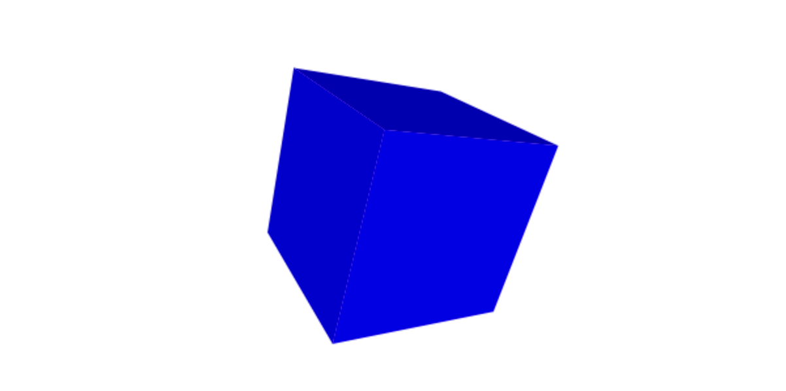
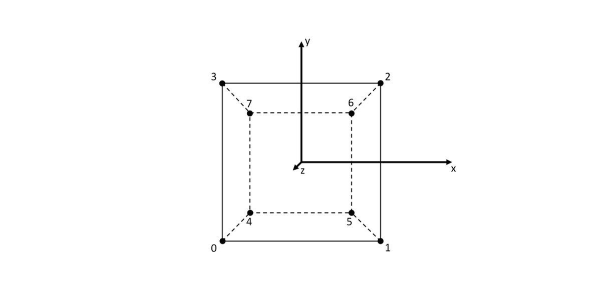
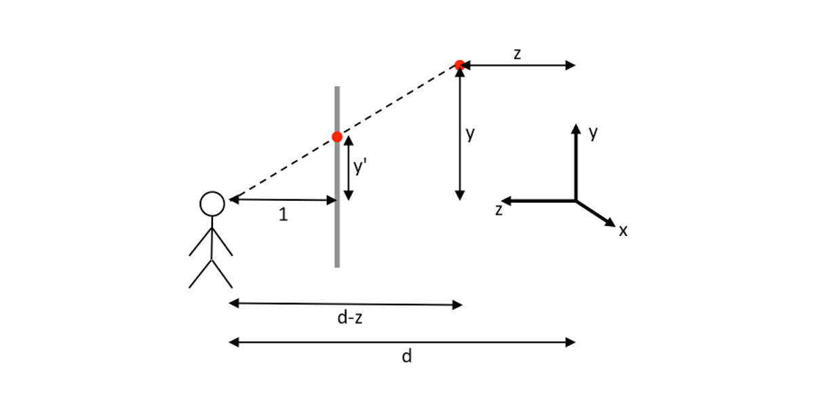
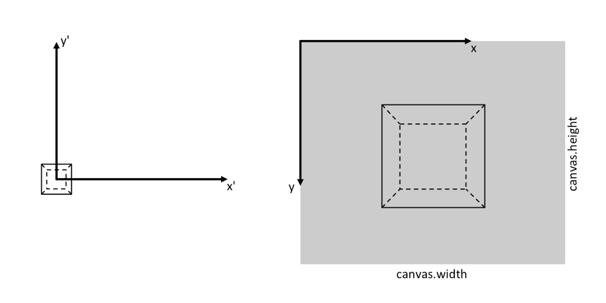
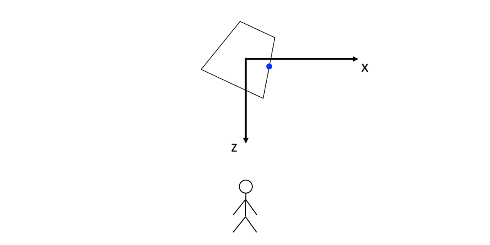

<div style="text-align:right; color:#aaa">Kristoffer Dyrkorn, May 4, 2024</div>

# Cubes, golfing and dual identities

<p align="center">

</p>

_Note: This is a translation of an article I wrote in 2016. You may notice that JavaScript conventions have changed since then :)_

In this three-part article, I will go through an unusual exercise in programming: How to create an app while making the source code as short as absolutely possible. Every byte counts.

In this first part we will make a small web app that shows a spinning cube. We will use the Canvas API and a bit of JavaScript and maths to make this happen. In [the second part](./2), we will work through the source code and shorten it. This process is often called code golfing: A quest to minimize source code while keeping the functionality unchanged. In [part three](./3), we'll make the source code even shorter by applying another trick involving what we may call "dual identities".

The three parts can be read independently. So, if you are interested in seeing how you can create 3D graphics from scratch in the browser, keep reading this part. Please note: It will get a bit nerdy. If you would rather take a look at code golfing in JavaScript, jump to [part two](./2). If compression tricks is your thing, [part three](./3) is the right place. Note: Part two and part three are also a bit nerdy.

The cube we will make looks like this:

<script async src="//jsfiddle.net/0p43xm2s/embed/result/"></script>

It has 6 surfaces (top, bottom, left, right, front and back) and 8 vertices - each with x, y and z coordinates. We start off by defining an array to store the vertex coordinates:

```
var points = [-1, -1, 1, 1, -1, 1, 1, 1, 1, -1, 1, 1, -1, -1, -1, 1, -1, -1, 1, 1, -1, -1, 1, -1];
```

The array contains the x, y, and z coordinates of each point, in sequence. A diagram makes the setup easier to understand:

<p align="center">

</p>

Here X points to the right, Y up and Z towards us, out of the screen. As you can see from the diagram, the first vertex (vertex 0) has coordinates (-1, -1, 1), and the next has (1, -1, 1).

We will now define the surfaces of the cube. We do this by creating a table where each group of 4 numbers describe one surface.

```
var faces = [0, 1, 2, 3, 0, 3, 7, 4, 0, 4, 5, 1, 6, 5, 4, 7, 6, 2, 1, 5, 6, 7, 3, 2];
```

The first surface, ie the front of the cube, is defined by the vertices (0, 1, 2, 3). The next surface is defined by the vertices (0, 3, 7, 4). We follow the convention that vertex numbers form a counter-clockwise sequence when the surface is facing us.

We will now make the cube rotate. We choose to do this by rotating each vertex around 2 axes - the z-axis and the y-axis. We keep the original, un-rotated vertices in the `points` array, and store new, rotated vertices in a separate array. When drawing the cube we use the rotated coordinates as input. And, each time we draw the cube we first increase the rotation angles a little bit, and then perform the rotation, and then draw. This makes the cube spin on the screen. Note that the surface definitions in the `faces` array remain unchanged.

Here is the code for rotation of vertices. We will not go into detail about the formulas - but the implementation looks like this:

```
// the rotated vertices are stored here
var rotated = [];

function rotate(y, z) {
  for (var i=0; i<points.length; i+=3) {
    // rotate around z axis
    rotated[i] = points[i] * Math.cos(z) - points[i+1] * Math.sin(z);
    rotated[i+1] = points[i] * Math.sin(z) + points[i+1] * Math.cos(z);

    // rotate around y axis
    var new_x = points[i+2] * Math.sin(y) + rotated[i] * Math.cos(y);
    rotated[i+2] = points[i+2] * Math.cos(y) - rotated[i] * Math.sin(y);
    rotated[i] = new_x;
  }
}
```

We loop over each of the original vertices, and first rotate around z. When rotating around this axis, the z coordinates remain unchanged - so we don't to do anything with them. Next, we use the already rotated x coordinates and the original z coordinates, and rotate around y. We use the temporary variable `new_x` to avoid overwriting the new x coordinate in the wrong place.

To make the cube look a bit more realistic, we add a perspective effect. A simple explanation of perspective could be that things that are closer to us must be drawn larger on the screen than things that are further away.

The maths can be figured out by imagining that you set up a camera some distance `d` from the center of the cube. The center has coordinates (0, 0, 0). We then calculate how the cube will look like if we project each vertex onto a surface placed 1 unit in front of the camera. This is how it can look like when viewed from the side:

<p align="center">

</p>

The red dot to the right is one of the vertices in the cube in 3D space. The arrows pointing to it indicate the y and z coordinates. The gray vertical line is the surface we project vertices onto - we can pretend this is the screen. By looking at the diagram you might see that `y'/1 = y/(d-z)`. That means that the `y` value, as measured on the surface, called `y'` in the diagram, will be `y/(d-z)`. The y coordinates of vertices further away from the camera will be smaller since the z coordinates then will be lower, and then `(d-z)` is larger.

After having applied the perspective effect we need to do another, final, adjustment to the coordinates. First, the coordinates need to be scaled, since the unit from now on will be pixels and we want the cube to be larger than a couple of pixels. We also shift the center to the cube ends up in the middle of the canvas. In the diagram below, the perspective projection of the cube is shown on the left, and the screen projected version is on the right.

<p align="center">

</p>

The code to convert to suitable screen coordinates is here:

```
function project(scale, distance) {
  for (var i=0; i<rotated.length; i+=3) {
    rotated[i] = scale * rotated[i] / (distance - rotated[i+2]) + canvas.width/2;
    rotated[i+1] = -scale * rotated[i+1] / (distance - rotated[i+2]) + canvas.height/2;
  }
}
```

It is time to draw the surfaces (polygons) that make up the cube. The Canvas API has handy functions for drawing and filling polygons, and we only need to send 4 and 4 vertices to the API to draw each surface. First, we define the outline of the surface, and then the color, and then we send a command to draw it.

Here is the code:

```
// 6 shades of blue
var colors = ["#003", "#006", "#009", "#00b", "#00d", "#00f"];

function draw() {
  for (var i=0; i<faces.length; i+=4) {
    ctx.beginPath();
    ctx.moveTo(rotated[3*faces[i]], rotated[3*faces[i]+1]);
    var show = rotated[3*faces[i]+2];

    for (var j=1; j<4; j++) {
      ctx.lineTo(rotated[3*faces[i+j]], rotated[3*faces[i+j]+1]);
      show += rotated[3*faces[i+j]+2];
    }

    show = show / 4;

    ctx.closePath();
    ctx.fillStyle = colors[i/4];
    if (show > 0.15) {
      ctx.fill();
    }
  }
}
```

For each polygon, we mark the start, get the x and y coordinates of the first vertex, and set it as starting point. The commands `beginPath()` and `moveTo(...)` do that. Then, we use the `for` loop to read out the next 3 vertices and use `lineTo()` to specify a path to each of them. We close the path with `closePath()`, and then the last vertex will be connected to first. We have now defined the polygon outline. We specify the color, and tell the Canvas API to fill using `fill()`.

There is a small problem here: We have not considered that we will not see all the surfaces of the cube at the same time. We aim for a more realistic rendering than that - meaning we should just draw the surfaces that are facing us at any given time. But how? One way to do it, and that works well in this particular case, is to check the average z value of the vertices in each surface. If the average z is greater than 0, then the surface is facing towards us, and should be drawn. This works in principle, but as the perspective effect modifies the geometry a bit we need to set the threshold a bit higher. The final value, 0.15, was chosen after a bit of trial and error.

<p align="center">

</p>

The blue dot in this top-view diagram shows the average z coordinate of a surface. The surface will only become visible from the viewer when the average z is slightly larger than 0. We call `fill()` only in that case.

The animation loop is all that is left:

```
function animate() {
  requestAnimationFrame(animate);

  ctx.clearRect(0, 0, canvas.width, canvas.height);
  rotate(y, z);
  project(350, 5);
  draw();

  y += .018;
  z += .011;
}
```

Here, `requestAnimationFrame(...)` is used to ensure smooth animation. This function will synchronize the drawing and clearing of the canvas to the monitor's refresh rate. In the `animate()` function itself we first clear the canvas using `clearRect(...)`. We then rotate the vertices, calculate perspective, and draw the cube. Finally, we increase the rotation angles a bit so the cube will spin as the app runs.

The final application can be seen [here](./app/1.html). The source code is 2156 bytes when we include a little bit of comments, markup and layout code.

And with that, this first part is done. Read [part two](./2) to see what happens next, as we shrink the code! There is only one goal: to reduce the number of bytes while keeping the cube as before.
