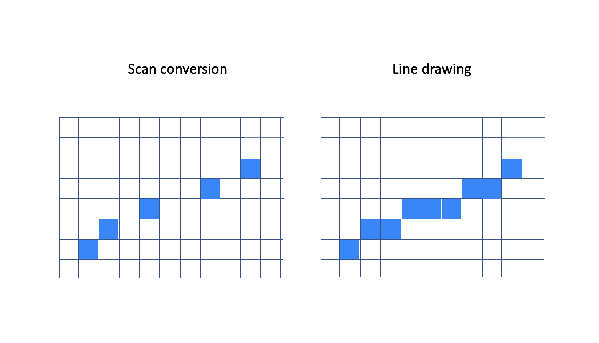

<div style="text-align:right; color:#aaa">Kristoffer Dyrkorn, March 9, 2025</div>

# An overview and a first implementation

(This article is part of a [series](./#sections). You can jump to the [previous section](./) or the [next section](2) if you would like to.)

Rasterization means to create a pixel-based version of geometry that is defined by some mathematical expression (a line, a circle, a curve or similar).

In this article series, we will focus on triangles only. A triangle can ideally be represented as three vertices connected by line segments. To rasterize a triangle means to calculate the right set of pixels that will recreate the triangle shape as closely as possible.

<p align="center">

</p>

We will reuse the HTML canvas setup from the previous article series - and use a low-resolution pixel surface as our drawing area. If you would like a quick refresher on how this is set up, see [section 2](../triangle-rasterizer/2) of the previous article series.

As before, we also assume that triangle vertices will be provided to us in a counterclockwise order.

<p align="center">

</p>

## The method

At the time when scanline rasterization was developed - in the late 60's - computers were very slow. That meant that a lot of care was taken to optimize code so programs were as effective and fast as possible. If you needed to draw a filled polygon, you would want to rely on horizontal lines, as those could be drawn quite fast. The way old CRT monitors used to draw images, was by scanning the electron beam across the screen in horizontal sweeps, one line at a time, from top to bottom. So a horizontal line could also be called a scanline.

In short, this rasterizer method consists of calculating the pixel coordinates of the left and right side edges of the triangle, and then drawing a set of horizontal lines that together will fill the triangle.

<p align="center">

</p>

In the illustration here, the left part shows the detailed process: The blue pixels form the left and right edges of the triangle, and the red outlines show the horizontal lines that need to be drawn. On the right you can see the resulting triangle.

That's it - that is the method: Finding the start and end points of each horizontal line that will need to be drawn to represent the triangle. And then draw those lines. We convert the triangle into a set of scanlines - hence the name scanline conversion.

Let's take a look at how this can be done in practice.

## A first implementation

We use the same triangle setup as [in the previous article](../triangle-rasterizer/3). We start with defining a triangle by its vertices and a color:

```JavaScript
const vertices = [];
vertices.push(new Vector(140, 100, 0));
vertices.push(new Vector(140, 40, 0));
vertices.push(new Vector(80, 40, 0));

const greenTriangleIndices = [0, 1, 2];
const greenTriangle = new Triangle(greenTriangleIndices, imageData);

const greenColor = new Vector(120, 240, 100);

greenTriangle.draw(vertices, greenColor);
```

Here we use an array to hold the vertex coordinates of the triangle. We define indices to those vertices, and then instantiate a `Triangle` object that contains pointers to the vertices. We also define a triangle color by its red, green and blue components, and finally draw the triangle using the vertex array and the specified color as input.

We will rely on a `Vector` class for grouping of numbers that belong together - such as 3D coordinates and RGB color values.

The vertex indices for each triangle are stored inside each `Triangle` object. We keep the vertex coordinates outside, in a separate array. This way we can move vertices around (update their positions) while still keeping the basic structure of a triangle, the vertices that define it, as-is.

Also notice that the vertices are specified in counterclockwise order (in screen coordinates, `y` points downwards).

The first part of the triangle drawing method is very similar to the previous version:

```JavaScript
  draw(coordinates, color) {
    const v = [];
    v[0] = [coordinates[this.va][0], coordinates[this.va][1]];
    v[1] = [coordinates[this.vb][0], coordinates[this.vb][1]];
    v[2] = [coordinates[this.vc][0], coordinates[this.vc][1]];

    const ab = [v[1][0] - v[0][0], v[1][1] - v[0][1]];
    const ac = [v[2][0] - v[0][0], v[2][1] - v[0][1]];

    // only draw if determinant is positive
    // in that case, the vertices are oriented counter-clockwise, ie the triangle is front-facing.
    if (ab[1] * ac[0] - ab[0] * ac[1] <= 0) {
      return;
    }

    (...)
```

We use the vertex indices stored inside this `Triangle` object to read out the actual screen coordinates for the triangle.

## Scan converting edges

We are now at the core of this approach - we need to calculate the start and end points of each horizontal line before we can draw it. This means, we need to find the `x` coordinates for each `y` coordinate as we step along each of the left and right side edges - from top to bottom - of the triangle. Have a look at this illustration again:

<p align="center">

</p>

This is often called scan converting an edge, and might look similar to drawing a line between two points. And it is! The main difference is that we here need to calculate only one `x` coordinate for each step in the `y` direction. If we compare a near-horizontal edge to a near-horizontal line, it is easy to see that when scan converting, we don't need to calculate all the pixels along the line - as the output does not need to be solid. Finding the outermost pixel for each `y` coordinate will be sufficient. (In this illustration, the edge would be a left-side edge in the triangle.)

<p align="center">

</p>

Here is the scan conversion function that we will use in this first implementation. It is relatively simple, but sufficient for now. Please note that in this implementation we will not find the outermost pixel for each `y` coordinate, we will instead find the innermost one. As long as we are consistent, so that any neighbour triangle edge will be scan converted the same way as we do here, we will not get artifacts such as gaps or overlaps between the triangles.

```JavaScript
  scan(start, end, buffer) {
    let x = start[0];
    const dx = (end[0] - start[0]) / (end[1] - start[1]);
    for (let y = start[1]; y <= end[1]; y++) {
      buffer[y] = Math.round(x);
      x += dx;
    }
  }
```

The function takes in three parameters - a 2D `start` point, a 2D `end` point, and a `buffer`. The end points contain `x` and `y` coordinates for the upper and lower endpoints of the edge. The `buffer` is an array where we store the `x` coordinate of the edge, for each integer `y` we traverse along the edge from top to bottom.

We first calculate `dx` - the difference in `x` for each step in `y`, and then we iterate over all integer `y` coordinates along the edge (inclusive the end points). For each iteration, we store the current `x` coordinate, rounded off to its nearest integer value, and then advance `x` by `dx`.

You might wonder if there is a risk for a division by zero here. What happens if the `y` coordinates of the `end` and `start` points are equal? That only happens if an edge is horizontal. Fortunately for us, horizontal edges do not need to be scan converted, and we can ensure that this situation will not occur. We will get back to how, but for now, assume that division by zero will not be a problem.

We need to explain the `buffer` parameter in more detail. When drawing the horizontal lines, we rely on having a set of start and end coordinates (`x` values) available for each line. We will store those in two arrays, one for the left side (called `startBuffer`) and one for the right side (called `endBuffer`). The two arrays will have the same size as the height of the screen. This so we can store both start and end `x` coordinates for any horizontal line on the screen.

The buffers are set up in the `Triangle` constructor:

```JavaScript
constructor(vertexIndices, screenBuffer) {
    this.screenBuffer = screenBuffer;

    this.va = vertexIndices[0];
    this.vb = vertexIndices[1];
    this.vc = vertexIndices[2];

    this.startBuffer = new Uint16Array(this.imageData.height);
    this.endBuffer = new Uint16Array(this.imageData.height);
}
```

The two buffers could have been instantiated only once, and reused across all the triangles. That optimization has not been done here.

# Tying things together

We now have described the overall method, and we have written code to find the start and end `x` coordinates for each `y` coordinate in an edge. We will now add the missing part: How to draw the full triangle - using the three vertices as input - by drawing horizontal lines.

In the function that scans an edge, we assume we will only be working in increasing `y` direction (downwards on the screen). We also assume we know which buffer to put the `x` coordinates into - ie whether this is a start `x` coordinate or an end `x` coordinate. Or, put differently, whether this is a left edge or a right edge in the triangle.

How can we know this for sure? Fortunately, relying on the vertices being provided in a consistent (counterclockwise) order answers the question without adding much complexity.

We start the drawing steps by calling an intermediate function `scanEdge(...)`, three times, one for each edge. Note that we define edges on the fly via pairs of vertices, and that we are careful to keep the winding order as-is.

```JavaScript
draw(screenCoordinates, color) {
    // get screen coordinates for this triangle
    const va = screenCoordinates[this.va];
    const vb = screenCoordinates[this.vb];
    const vc = screenCoordinates[this.vc];

    const determinant = this.getDeterminant(va, vb, vc);

    // only draw if determinant is positive
    // in that case, the triangle is counter-clockwise oriented
    if (determinant <= 0) {
        return;
    }

    this.scanEdge(va, vb);
    this.scanEdge(vb, vc);
    this.scanEdge(vc, va);

    (...)
```

Now, let's look at the internals of the `scanEdge(...)` function. But first, let's have a look at some facts we can derive from the counterclockwise vertex ordering:

- If the start point for an edge is higher up (has a smaller `y` value) than the end point, it has to be a left side edge.
- If the start point for an edge is lower (has a greater `y` value) than the end point, it has to be a right side edge.

Have a look at this illustration and then this will hopefully make more sense.

<p align="center">

</p>

We will need to put the `x` coordinates of the two triangle edges into the correct buffers (holding start `x` and end `x` values, respectively). By using the facts above it we will know whether a given edge is a left or right side edge.

We also need to establish a third fact:

- If the start and end points for an edge are equal, we don't need to scan the edge.

This happens since we fill the triangle by horizontal lines. That means we need to find the `x` coordinates of the edges while we traverse them vertically, one line at a time. However, a purely horizontal edge will have no vertical component.

If an edge is horizontal, we will also know that none of the other edges will be horizontal - or else the triangle would have had zero area. In that case the check that ensures the determinant is positive (before drawing anything) would have kicked in, and we would have jumped out of the function.

So, in this case, we know that the other two edges will be scan converted. This means we will get the needed start and end `x` coordinate values for the entire triangle from there and that it can be drawn in the normal manner.

Here is the implementation of the `scanEdge(...)` function:

```JavaScript
    scanEdge(va, vb) {
        // if vertex a is above vertex b then edge a->b is a left edge
        if (va[1] < vb[1]) {
            this.scan(va, vb, this.startBuffer);
        } else if (va[1] > vb[1]) {
            // or, if vertex b is above vertex a then edge b->a is a right edge
            this.scan(vb, va, this.endBuffer);
        }
        // note: if vertex a and b form a horizontal edge, we can ignore that case,
        // since we will not need to scan the edge.
    }
```

If you look through some of the scan conversion implementations on the internet you will likely find examples that check whether the endpoints are provided in increasing `y` order, and swap vertices as needed. Or, code that checks for division by zero before calculating the edge slope. Or, code that checks whether the start `x` coordinate for a horizontal line is less than the end `x` coordinate, and swaps them if needed.

In the code here, we have instead relied on logic inferred from the counterclockwise ordering rule, along with some carefully set up edge scanning rules, and avoided those tests. Fewer checks means simpler and faster code - and in a sense, this illustrates a common trait of effective code: By properly handling the cases at a higher abstraction level, we remove the need for detailed (and, at times, redundant) tests in lower level code. By reusing what we know (or can infer) we get closer to a minimal - and thus faster - implementation.

## Drawing horizontal lines

All that is left now, is to draw the horizontal lines. We do this by iterating over the full range of `y` coordinates, from top to bottom of the triangle - and then drawing the pixels from the left edge to the right edge. We get hold of the `x` coordinates by reading them out from the `startBuffer` and `endBuffer` arrays.

The `imageDataOffset` variable is used to keep track of the address (the offset from zero) in the image buffer where we want to write our pixel values. This variable refers to offsets measured in bytes. Each pixel consists of 4 byte values (R, G, B and alpha/transparency) in sequence, so we need to multiply the offsets by 4 here and there. This is implemented by shifting left 2 places (`<< 2`) for maximum performance.

For more details on how the RGB values in this array end up as pixels on screen, see [section 2](../triangle-rasterizer/2) in the previous article series.

```JavaScript
    const ymin = Math.min(v[0][1], v[1][1], v[2][1]);
    const ymax = Math.max(v[0][1], v[1][1], v[2][1]);

    // initial offset: point to x=0, y=ymin
    let imageDataOffset = (ymin * this.imageData.width) << 2;

    let y = ymin;
    while (y <= ymax) {
      let x = this.startBuffer[y];
      let endx = this.endBuffer[y];
      let i = imageDataOffset + (x << 2);

      while (x <= endx) {
        this.imageData.data[i++] = color[0];
        this.imageData.data[i++] = color[1];
        this.imageData.data[i++] = color[2];
        this.imageData.data[i++] = 255;
        x++;
      }
      y++;

      // point to x=0 on the next line
      imageDataOffset += this.imageData.width << 2;
    }
  }

```

The `color` array contains the RGB values for the triangle, and in the inner loop, we write those values out to the image buffer, one byte at a time. The hard coded `255` value here makes all triangles fully opaque.

And with that, we have our first version of the rasterizer up and running! In the [next section](2) we will start refining it. In the meantime, have a look at the [demo app for this section](1/)!
