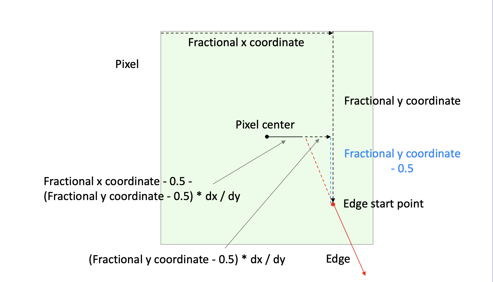

<div style="text-align:right; color:#aaa">Kristoffer Dyrkorn, March 9, 2025</div>

# How to be smooth

(This article is part of a [series](./#sections). You can jump to the [previous section](3) or the [next section](5) if you would like to.)

To get smoother animations when we rotate the triangles we will now introduce subpixel precision in the rasterizer. Subpixel might be a mysterious term but in practice it means to keep (and take into consideration) as much information as possible when scan converting edges. In this case, it means to not round the real-value input coordinates to integers before drawing the triangles, but to also use the fractional values when identifying the `x` coordinates while traversing the edge.

First, we need to do some preparations: We will now use real-valued (continuous) vertex coordinates as the input to the rasterizer. For more details, see [the section on continuous coordinates](../triangle-rasterizer/6) in the previous article. We will also switch to using the fixed point representation for our coordinates. This way we get higher numerical resolution than integers but we still avoid numerical issues. See [this section](triangle-rasterizer/7#the-solution-fixed-point-numbers) if you are curious.

## What does this mean in practice?

The input coordinates to the rasterizer will now have higher resolution, and as a result the edge endpoints will not be located only at the pixel centers. They can be placed anywhere inside a pixel, as precisely as the fixed point representation allows.

When traversing an edge in the `y` direction, we will now use fixed point values when we calculate whether to stay on the same `x` coordinate, or, to step one pixel to the side.

At the same time, the definition of the edge slope does not change, it is still `dx` over `dy`. But now both numbers - and thus the numerator and the denominator in our fraction - will be fixed point values.

The horizontal line drawing itself will not change. The `x` and `y` coordinates taken as inputs need to remain integers, since pixel addresses remain integers. We solve this by truncating the fixed point values to integers before sending them to the line drawing function.

In the scan conversion, as we traverse an edge downwards, we calculate an `x` coordinate per horizontal `y` line - as before. But now we need to decide for which `y` coordinate inside a pixel the calculations should apply. We pick the most representative one, at the pixel's vertical center, meaning `integer value` + 0.5.

The changes we have mentioned so far are mainly related to data types and conventions. The actual change in logic happens where we set up the scan conversion process - where we initialize the numerator with the right value.

The numerator encodes the current horizontal position of the edge - inside the pixel we are looking at. We will refer to this as the fractional `x` coordinate. The value of the fraction `dy` / `dx` decides when we need to step one pixel to the side. The numerator used to be initialized to zero when we run on integer coordinates.

But now we need to calculate a new initial value for the numerator that reflects the real-valued `x` coordinate of the starting point of the edge. Since our horizontal lines are located on `y` coordinates having `integer value` + 0.5, we will calculate the `x` coordinate at that vertical location inside the pixel. We may have to extend the edge to find this value.

This is what is needed to implement subpixel support. The rest of the process does not change.

We will now have closer look at how we can calculate the new inital value for the numerator. Here is an illustration of the case where `y` is the major axis and the edge goes down and to the right. That means that both `dx` and `dy` will be positive. (As before, other cases can be supported via symmetry - ie by swapping `dx` with `dy` and changing signs in a few locations.)

<p align="center">

</p>

This diagram is a bit complex, so let's have a look at it step by step.

The light green square is the current pixel we are looking at. It contains the starting point of an edge we want to scan convert - marked with a red dot (see down and to the right inside the pixel). The edge extends further down and to the right.

Now, look at the diagram, and start in the top left corner of the pixel. Follow the arrow to the right. This is the fractional `x` coordinate of the start point. Follow the arrow downwards. This is the fractional `y` coordinate of the start point. We now extend the edge upwards and to the left, along the dotted red line, until it intersects a horizontal line where the fractional `y` coordinate is 0.5. The vertical distance we have moved, up to the pixel center, is `fractional_y - 0.5`. The horizontal distance we have moved, is `(fractional_y - 0.5) * dx / dy`. The `y` coordinate of our current location will now be 0.5, and the `x` coordinate will be `fractional_x - 0.5 - (fractional_y - 0.5) * dx / dy`.

The `x` coordinate now represents the horizontal distance from the pixel center and to the starting point of the (extended) edge. This is what we needed to calculate to enable subpixel precision. The value expresses how far from the pixel center the scan conversion starts, and that is what we need to reflect in the fraction we use. But after that point, we the scan conversion can be run as before.

We need to keep in mind that the fraction we are using in our scan conversion loop is expressing a horizontal distance. That means, the numerator alone describes a horizontal distance that is multiplied by the denominator value. So, to correctly initialise the numerator, we need to convert the distance we have just found by multiplying the distance with the current denominator value, which is `dy` in this case.

The resulting code is:

```JavaScript
    // get the fractional x coordinate where the edge intersects the horizontal line through the pixel center
    const x_intersect = start_x_fractional - Math.round((start_y_fractional - FixedPointVector.HALF) * dx_dy);

    // calculate the horizontal offset from the ideal starting point (the pixel center)
    const x_offset = x_intersect - FixedPointVector.HALF;

    // convert the offset into a numerator value, by multiplying by dy and rounding off
    let numerator = (dy * x_offset + FixedPointVector.HALF) >> FixedPointVector.SHIFT;
```

The code where we traverse the edge downwards, looping over integer `y` values, now becomes:

```JavaScript
    // get the x coordinate of the first pixel
    let x = start[0];

    // truncate the fixed point start and end y coordinates since we operate on integer y coordinates
    let y = start[1] >> FixedPointVector.SHIFT;
    let end_y = end[1] >> FixedPointVector.SHIFT;

    while (y < end_y) {
      numerator += dx;
      if (numerator > dy) {
        x += signdx;
        numerator -= dy;
      }
      buffer[y] = x;
      y++;
    }
```

In other words: The inner loop does not change! The change needed to enable subpixel support is restricted to the initialization of the numerator before entering the loop. That means the extra calculations are needed only once per edge - which means that subpixel support should be fast.

Have a look at the [demo app for this section](4/) - and notice how smooth the animation now runs! There is no noticeable performance hit either. However, there is an old saying that a software rasterizer will never be fast enough. So in the [next section](5) we will optimize the code we have just added here.
