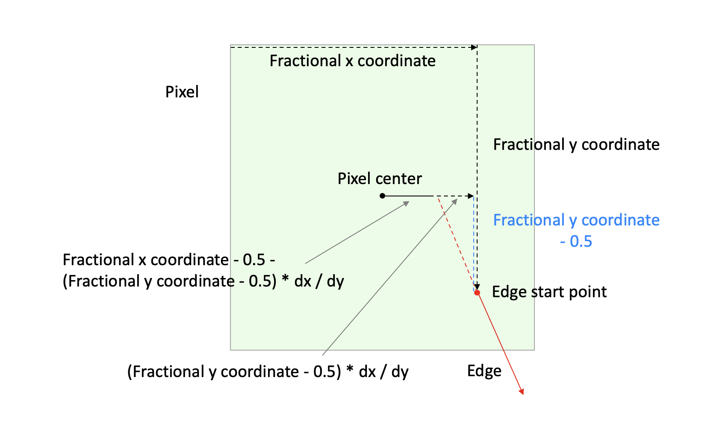

<div style="text-align:right; color:#aaa">Kristoffer Dyrkorn, March 10, 2025</div>

# How to be smooth

(This article is part of a [series](./#sections). You can jump to the [previous section](3) or the [next section](5) if you would like to.)

To get smoother animation when we rotate the triangles we will now introduce subpixel precision in the rasterizer.

First, we need to do some preparations: We will switch to using real-valued vertex coordinates as the input to the rasterizer. For more info about that, see [the section on continuous coordinates](../triangle-rasterizer/6) in the previous article. We will also switch to using the fixed point representation to represent numbers. This way we have higher numerical resolution than integers and still avoid numerical issues. See [this section](triangle-rasterizer/7#the-solution-fixed-point-numbers) if you are curious about this numerical representation and its properties.

## What does this mean in practice?

The vertex coordinates will now be more precise, and as a result edge endpoints will not be located only at the pixel centers. They can be placed anywhere inside a pixel, and as precisely located as the fixed point representation allows.

We will make use of the higher resolution coordinates when we scan convert edges. So, when traversing an edge in the `y` direction, we will now use fixed point values when we calculate whether to stay on the same `x` coordinate, or, to step one pixel to the side.

The basis of the edge slope value does not change, it is still `dx` over `dy`, but both values are now fixed point values. So, the fraction we use will now have fixed point values in both the numerator and the denominator.

The horizontal line drawing itself will not change. The `x` and `y` coordinates taken as inputs need to remain integers, since pixel adresses remain integers. We solve this by truncating values to integers before sending them to the drawing function.

In the scan conversion, as we traverse an edge downwards, we calculate an `x` coordinate per horizontal `y` line. We need to decide for which `y` those calculations should apply. We pick the most representative one, at the pixel's vertical center, meaning `integer value` + 0.5.

The changes so far are mainly related to data types and conventions. The actual change in logic happens where we initialize the scan conversion process - where the numerator value of our fraction is set.

The numerator encodes the horizontal position of the edge, inside the current pixel. We will refer to this as the fractional `x` coordinate. The value of the fraction decides when we need to step one pixel to the side. In the current code, the numerator is initially set to zero. This is a consequence of our starting point being directly on the pixel center.

We need to calculate a new initial value for the numerator, that reflects the real-valued `x` coordinate of the starting point of the edge. Our horizontal lines work on `y` values of `integer value` + 0.5, so we will have calculate the `x` value for that location (extending the edge if necessary), and find the horizontal distance to the pixel center there.

And, actually, this is all that is needed to implement subpixel support. The rest of the proess does not change.

Let's have a closer look at how we can use geometry to calculate the new numerator value. Here is an illustration where `y` is the major axis and the edge goes down to the right. This means that both `dx` and `dy` will be positive. (As before, the other cases can be supported via symmetry - ie by swapping `dx` with `dy` and changing signs in a few locations.)

<p align="center">

</p>

The diagram is a bit complex, so let's look at it step by step.

We have light green pixel that contains the start point (a red dot) of an edge we want to scan convert. The edge extends down and to the right.

Now, look at the diagram, and start in the top left corner of the pixel. Follow the arrow to the right. This is the fractional `x` coordinate of the start point. Follow the arrow downwards. This is the fractional `y` coordinate of the start point. We now extend the edge upwards and to the left, along the dotted red line, so it intersects the horizontal line going through the center of the pixel at a fractional `y` coordinate of 0.5. The vertical distance we will have moved, up to the pixel center, is `fractional_y - 0.5`. The horizontal distance we have moved will be `(fractional_y - 0.5) * dx / dy`. The `y` coordinate of our current location is now 0.5, and the `x` coordinate is `fractional_x - 0.5 - (fractional_y - 0.5) * dx / dy`.

The `x` coordinate will now represent the horizontal distance from the pixel center and to the starting point of the edge. This means we are now all set to calculate the new numerator value - but we need to keep in mind what the whole fraction is expressing - a horizontal distance. So, the numerator itself describes a distance pre-multiplied by the denominator value. To set the numerator value correctly, we need to convert the distance we just found into the correct unit - by multiplying it with the denominator, `dy`.

The resulting code is:

```JavaScript
    // get the fractional x coordinate where the edge intersects the horizontal line through the pixel center
    const x_intersect = start_x_fractional - Math.round((start_y_fractional - FixedPointVector.HALF) * dx_dy);

    // calculate the horizontal offset from the ideal starting point (the pixel center)
    const x_offset = x_intersect - FixedPointVector.HALF;

    // convert the offset into a numerator value, by multiplying by dy and rounding off
    let numerator = (dy * x_offset + FixedPointVector.HALF) >> FixedPointVector.SHIFT;
```

The code where we traverse the edge downwards, looping over integer `y` values, now becomes:

```JavaScript
    // get the x coordinate of the first pixel
    let x = start[0];

    // truncate the fixed point start and end y coordinates since we operate on integer y coordinates
    let y = start[1] >> FixedPointVector.SHIFT;
    let end_y = end[1] >> FixedPointVector.SHIFT;

    while (y < end_y) {
      numerator += dx;
      if (numerator > dy) {
        x += signdx;
        numerator -= dy;
      }
      buffer[y] = x;
      y++;
    }
```

In other words: The inner loop does not change! The change needed to enable subpixel support is restricted to just the setup part outside the loop (calculating the inital numerator value). Those extra operations will only be required once per edge, which means that subpixel support should be fast.

Have a look at the [demo app for this section](4/) - and notice how smooth the animation now runs! There is no noticeable performance hit either. However, there is an old saying that a software rasterizer will never be too fast, so in the [next section](5) we will optimize the code we just added here.
