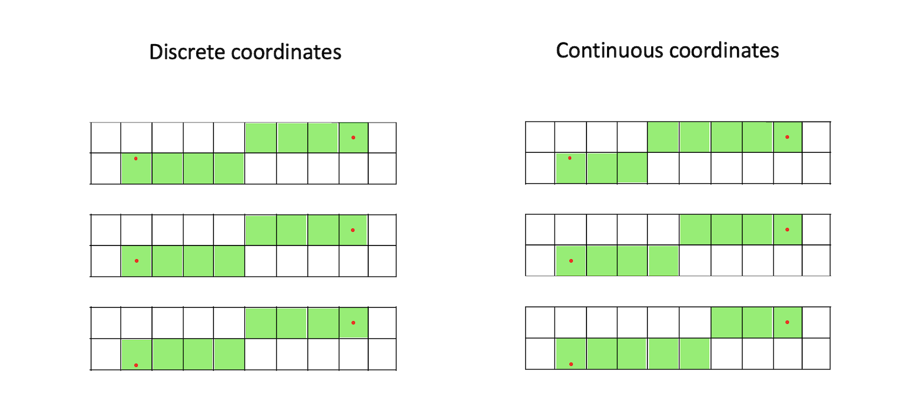
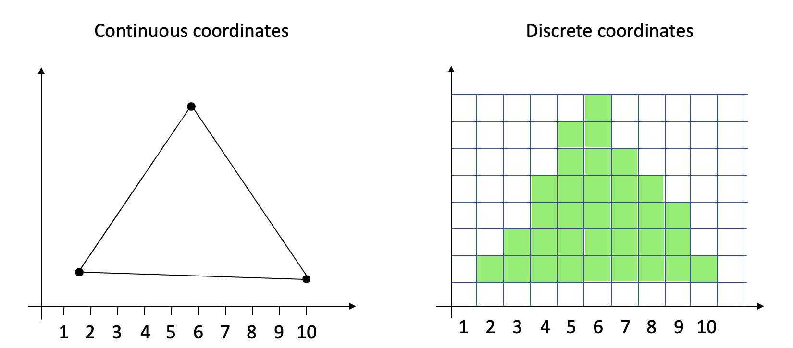
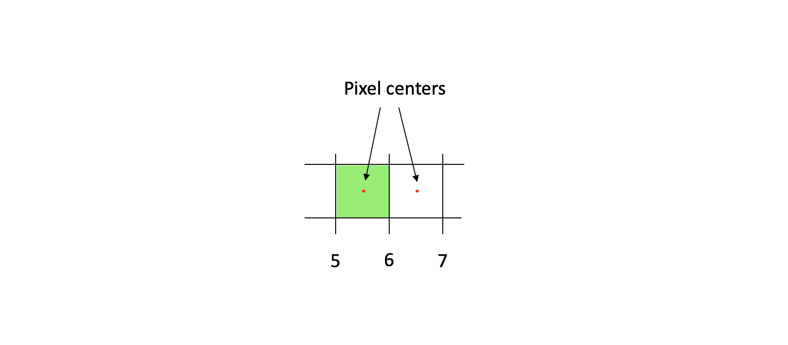
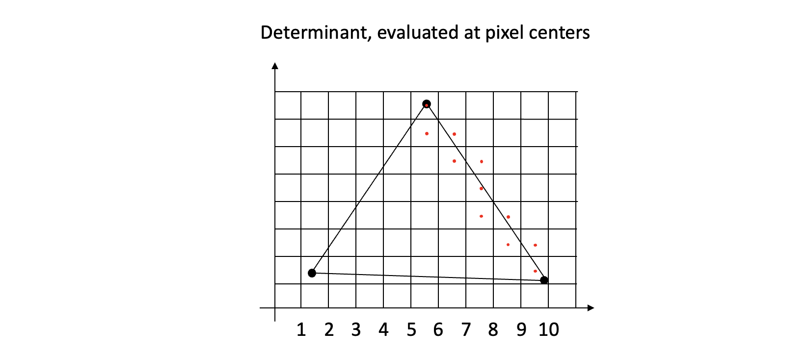

<div style="text-align:right; color:#aaa">Kristoffer Dyrkorn, November 4, 2022</div>

# 6. Let's go continuous!

(This article is part of a [series](./#sections). You can jump to the [previous section](5) or the [next section](7) if you would like to.)

In this section, we will improve the smoothness of the animation.

## Using floating point values when calculating determinants

So far, we have only used integer values when drawing things on screen. But, as we rotate our triangles, the new vertex coordinates will get non-integer values. We have - until now - rounded coordinates off to integers before sending them to the rasterizer. This means that all calculations in the rasterizer have been performed on coordinate values that have been slightly shifted around a bit. The shifts are small (less than one pixel) but will have random direction, and the result is that the triangles have jumped around a bit as they rotate.

One way to improve on the situation is to base the calculations in the rasterizer directly on the floating point values from the rotated vertices.

We will still need to put pixels on the screen using integer coordinates, since that is the only way to address the screen buffer, but from now on we will do so without first rounding the vertex coordinates.

The improvement can be illustrated by looking at line drawing - and what happens if one of the end points of a line stays fixed while the other one is slowly moving. In this illustration, notice how differently the position of the left endpoint impacts the line drawing in the two cases:

<p align="center">

</p>

When using discrete coordinates, the rounding moves the end points to the the pixel centres - so the lines look the same in all cases. But, when using continuous coordinates, the position of the moving endpoint - inside the pixel - does have an influence on how the line is drawn. The difference might seem small here (only one pixel), but as we will see, the change will improve the visual quality quite a bit.

We will now evaluate triangle candidate pixels in a different way than before. Let's have a closer look.

## Keeping vertices as floating point numbers

In the application, the only change we will make is that we don't round off the rotated vertex coordinates. The `rotate(angle)` function now looks like this:

```JavaScript
function rotate(angle) {
    const DEG_TO_RAD = Math.PI / 180;

    for (let i = 0; i < 4; i++) {
        const v = new Vector(vertices[i]);
        v.sub(center);

        const r = rotatedVertices[i];
        r[0] = v[0] * Math.cos(angle * DEG_TO_RAD) - v[1] * Math.sin(angle * DEG_TO_RAD);
        r[1] = v[0] * Math.sin(angle * DEG_TO_RAD) + v[1] * Math.cos(angle * DEG_TO_RAD);

        r.add(center);
    }
}
```

In the rasterizer, we now receive floating point coordinates. However, we would still like our bounding box to be defined by integer coordinates. We still loop over pixel coordinates (integer values) when we check whether pixels should be drawn or not. So we want an easy way to calculate and keep track of the final screen coordinates for the pixels we are going to draw.

We use rounding up or down (depending on whether we look at min or max values) to modify the bounding box so it covers the triangle while also expanding it out to the nearest integer coordinates.

```JavaScript
const xmin = Math.floor(Math.min(va[0], vb[0], vc[0]));
const ymin = Math.floor(Math.min(va[1], vb[1], vc[1]));

const xmax = Math.ceil(Math.max(va[0], vb[0], vc[0]));
const ymax = Math.ceil(Math.max(va[1], vb[1], vc[1]));
```

Now comes the important part: We no longer use integer values when calculating the determinant values.

## Going from a continuous to a discrete coordinate space

The vertex coordinates used to be integers, and refer to a location in a grid of discrete values. But now they represent a point in a continuous two-dimensional space. The edges between vertices also exist in the same space.

How can ve convert the edges to integer coordinates for pixel drawing?

We can imagine putting a grid, with a spacing of 1 by 1, on top of the continuous vertex space. The grid lines intersect at integer values, and the grid cells represent pixels.

<p align="center">

</p>

This means that the pixel borders are found at integer coordinates, and pixel centers are located at coordinate values of (integer) + 0.5, for both x and y.

<p align="center">

</p>

When we now draw a triangle, we loop through all coordinates inside our integer bounding box, and calculate the determinant value at pixel centers, ie at (integer + 0.5). So a triangle will need to cover those locations for pixels to be drawn. (The illustration here only shows the candidate points located along the right triangle edge.)

<p align="center">

</p>

Put differently, we traverse the bounding box on screen (using integer coordinates), and _sample_ the continuous coordinate space (where the triangles are defined) at pixel center locations. Also see the classic article ["A pixel is _not_ a little square"](http://alvyray.com/Memos/CG/Microsoft/6_pixel.pdf) by Alvy Ray Smith.

## Implementing the changes

Our updated inner loop now looks like this:

```JavaScript
for (let y = ymin; y <= ymax; y++) {
    for (let x = xmin; x <= xmax; x++) {
        p[0] = x + 0.5;
        p[1] = y + 0.5;

        w[0] = this.getDeterminant(vb, vc, p);
        w[1] = this.getDeterminant(vc, va, p);
        w[2] = this.getDeterminant(va, vb, p);

        if (this.isLeftOrTopEdge(vb, vc)) w[0]--;
        if (this.isLeftOrTopEdge(vc, va)) w[1]--;
        if (this.isLeftOrTopEdge(va, vb)) w[2]--;

        if (w[0] >= 0 && w[1] >= 0 && w[2] >= 0) {
            this.buffer.data[imageOffset + 0] = color[0];
            this.buffer.data[imageOffset + 1] = color[1];
            this.buffer.data[imageOffset + 2] = color[2];
            this.buffer.data[imageOffset + 3] = 255;
        }
        imageOffset += 4;
    }
    imageOffset += imageStride;
}
```

We choose to add (and not subtract) 0.5 from the coordinates when we move from discrete space to continuous space. This way we don't have to deal with negative values anywhere on screen. (See [this article](https://www.realtimerendering.com/blog/the-center-of-the-pixel-is-0-50-5/) for details.)

## A quick recap

We keep the input vertex coordinates as they are (floating point values), and calculate a bounding box having integer coordinates - just as before. We then loop through each integer (pixel) location inside the bounding box, evaluate the determinant at each pixel center, and use the result to decide whether to draw that pixel or not.

The net effect is that the fractional values of the vertex coordinates are kept in consideration in all of the determinant calculations along the triangle edges. The result is that the rasterizer will now render the triangle in a much more precise way. We are able to do the conversion from continuous space (where the triangle was mathematically defined) to a discrete space (where the pixels are drawn) with higher resolution than before. Just as the line drawing example in the very beginning of this section illustrated.

Here is the result - the two triangles now rotate smoothly. This looks good!

<p align="center">
<video src="images/6-floating-point-rotate-glitch.mp4" autoplay playsinline muted loop width="100%"></video>
</p>

But wait - there is something wrong here: Now and then there are white single-pixel gaps along the edge between the triangles. The fill rule is correct and we do use floating point numbers (with double precision, even). What is wrong? We will figure that out [next](7).

See [the code for this section](https://github.com/kristoffer-dyrkorn/triangle-rasterizer/tree/main/5) and the [utility classes](https://github.com/kristoffer-dyrkorn/triangle-rasterizer/tree/main/lib). The [demo app](6/) is, as always, available. Press `space` to show/hide the blue triangle, and `p` to turn the animation on/off.
