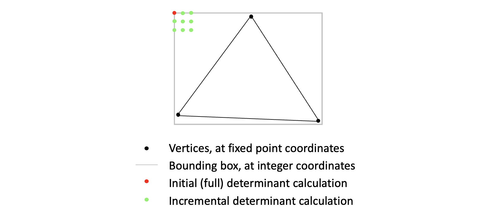
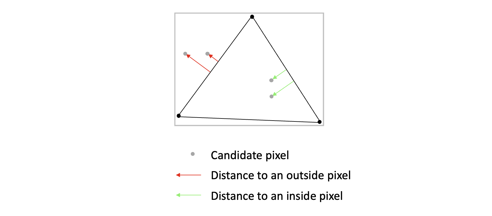

<div style="text-align:right; color:#aaa">Kristoffer Dyrkorn, November 4, 2022</div>

# 9. Time to go incremental

(This article is part of a [series](./#sections). You can jump to the [previous section](8) or the [next section](10) if you would like to.)

In this section we will improve the performance of the rasterizer. We would like to draw our triangles much faster so we can show and animate a lot more triangles at the same time. Hopefully we can do this without making the code that much more complicated or hard to read.

One way to optimize code for performance is to look for blocks of code that are executed many times, and see if there is a way to modify the work so that it will run faster. We can also try to redistribute work - eg move tasks that are executed many times to a place where they need to happen less frequent. Of course, the total computation must be kept unchanged so the program works as before.

The plan here is to restructure the work so the heavy, time-consuming calculations happen once per triangle draw call. Also, we will make the calculations that have to happen once per pixel be as light - and run as quickly - as possible.

## Making an incremental version of the rasterizer

Right now, we calculate one determinant and evaluate one fill rule per edge for each pixel inside the bounding box. That is, we calculate everything from scratch for each pixel. We do not reuse any of the previous calculations.

A common optimization trick is to try to calculate things incrementally. That means to start by doing an initial (and potentially) heavy calculation once, and then update the result as needed with small changes - deltas - as needed. Whether this trick improves the performance or not depends on whether the deltas can be calculated easily.

It turns out we can apply this trick here. We can do the full determinant and fill rule calculation for just one pixel, and then apply the change - when going from one pixel to the next - on top of the previous result.

<p align="center">

</p>

In this situation, we are lucky, since if you do the math (which we won't here) the change in determinant value per pixel - both horizontally and vertically - is constant. This might be understood intuitively if you recall that the determinant value is proportional to the shortest distance from a candidate pixel to a triangle edge. That means the change in value only depends of the slope of the triangle edge - and as long as both the triangle edges and the scanning of the bounding box follow straight lines the change will be constant.

<p align="center">

</p>

## Code changes

```JavaScript
// screen coordinates at the starting point (top left corner of bounding box, at pixel center)
const topLeft = new FixedPointVector(xmin + 0.5, ymin + 0.5, 0);

// calculate edge distances at starting point
const wLeft = new FixedPointVector();
wLeft[0] = this.getDeterminant(vb, vc, topLeft);
wLeft[1] = this.getDeterminant(vc, va, topLeft);
wLeft[2] = this.getDeterminant(va, vb, topLeft);

if (this.isLeftOrTopEdge(vb, vc)) wLeft[0]--;
if (this.isLeftOrTopEdge(vc, va)) wLeft[1]--;
if (this.isLeftOrTopEdge(va, vb)) wLeft[2]--;
```

We use the top left corner of the bounding box as the starting point. We then calculate the three determinants for that pixel, and put the result in the `wLeft` variable. We also calculate the fill rule adjustment for this pixel.

Since the adjustments are constant across entire triangle edges, we can calculate all determinants for the first pixel, apply the adjustments, and then all consecutive pixels inside the bounding box will already be adjusted. So we only need to evaluate the fill rule once. The incremental calculations take place on top of the initial adjustment.

We now calculate the change in determinant values when moving from one pixel to the next, both horizontally (`dwdx`) and vertically (`dwdy`). As you can see, finding the change per pixel is a very lightweight operation:

```JavaScript
const dwdx = new FixedPointVector();
dwdx[0] = (vb[1] - vc[1]) << FixedPointVector.SHIFT;
dwdx[1] = (vc[1] - va[1]) << FixedPointVector.SHIFT;
dwdx[2] = (va[1] - vb[1]) << FixedPointVector.SHIFT;

const dwdy = new FixedPointVector();
dwdy[0] = (vb[0] - vc[0]) << FixedPointVector.SHIFT;
dwdy[1] = (vc[0] - va[0]) << FixedPointVector.SHIFT;
dwdy[2] = (va[0] - vb[0]) << FixedPointVector.SHIFT;
```

We are now mostly ready. For each new horizontal line in the triangle, we use the current `wLeft` value as a starting point, and copy that value over to `w` - which contains the final determinant value at a given pixel location. Then, for each pixel `x` we add `dxdw` onto `w`. (Here, we actually subtract - due to the way we calculated the change. We could also have calculated a value with the opposite sign, and then used addition instead.) As we jump to the next horizontal line, we then add `dwdy` to the `wLeft` value, and then we are ready for the next loop iteration.

```JavaScript
// hold final w values here
const w = new FixedPointVector();

for (let y = ymin; y <= ymax; y++) {
    w.copy(wLeft);

    for (let x = xmin; x <= xmax; x++) {
        if ((w[0] | w[1] | w[2]) >= 0) {
            this.buffer.data[imageOffset + 0] = color[0];
            this.buffer.data[imageOffset + 1] = color[1];
            this.buffer.data[imageOffset + 2] = color[2];
            this.buffer.data[imageOffset + 3] = 255;
        }
        imageOffset += 4;
        w.sub(dwdx);
    }
    imageOffset += imageStride;
    wLeft.add(dwdy);
}
```

Here, we also have rephrased the expression for evaluating `w`: The values in `w` are fixed-point, but can be treated as integers when comparing to zero. So we can bitwise OR the three components together before testing whether the resulting value is larger than, or equal to, zero. This reduces the likelihood of branch misprediction, something that can be time-consuming on modern CPUs.

Looking at the code now, we see that the innermost loop only consists of copying values from one variable to another - and of adding or subtracting values. There is no obvious way to further simplify how we evaluate `w` for each pixel. Also note that we take care to instantiate all objects before we enter the loops. This way the browser will not need to spend time allocating (or garbage collecting) memory. So the overhead of memory management in the inner loops is eliminated.

We now call it a day. Drawing a single triangle takes 0.23 ms on my machine. We have made this version ten times as fast as the previous! All thanks to incrementally evaluating candidate pixels. There is likely a lot more optimzations that can be done, but we will stop here now. (The next section contains some ideas.)

Anyway, the result is a fast, smooth and correct triangle rasterizer. Not bad! In the [next section](10) we will round off this tutorial.

Here you can look at the final version [of the code](https://github.com/kristoffer-dyrkorn/triangle-rasterizer/tree/main/9) and the [utility classes](https://github.com/kristoffer-dyrkorn/triangle-rasterizer/tree/main/lib). There is also [the final demo app](9/). As before, press `space` to show/hide the blue triangle, and `p` to turn the animation on/off.
