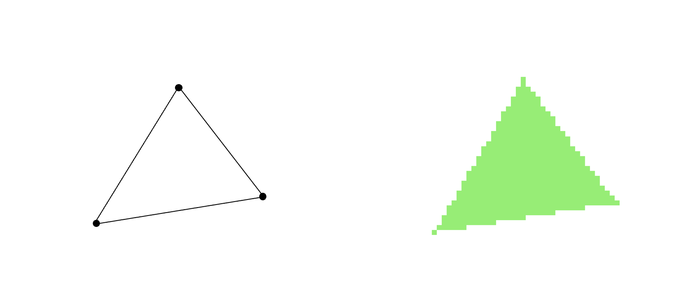

# A fast and correct triangle rasterizer

In this article series, you will get to learn how a computer draws a triangle on screen. This may look like a weird thing to study, but if you go through the series you will hopefully discover that there are surprising details, tradeoffs and complexity in drawing triangles.

This phenomenon is not unusual in the field of computer graphics - or even computer science itself: If you stumble upon a problem and ask yourself: "Can it be that hard" - then well, yes, sometimes it can! Drawing a triangle on screen correctly and efficiently is certainly not trivial. At the same time, it is often considered an "old" and "already solved" problem. However, that should not stop us from diving into this subject! Depending on your experience and skill level there are likely a few tricks to learn here, tricks that can be useful in other fields related to programming - for example maths, numerics, computer graphics or performance optimization.

As a start, let's have a look at what it means to draw a triangle on the screen. This process is often called triangle rasterization. The term can be explained as follows: A triangle is defined by three points (vertices). By drawing lines between each of them the triangle appears.

However, a computer cannot draw an ideal triangle, consisting of lines, directly. On a computer screen we have to draw pixels. Put differently: We have to instruct the computer to change the colors for a certain set of pixels on the screen. Screen pixels are organized in a regular grid, a _raster_, and this is what coins the term: By rasterization we mean the process of figuring out how to draw some geometry, defined by lines, on a pixel screen.

This tutorial is structured as follows: First, you will get to know the principles behind triangle rasterization and the spesific approach we will use here. Then we will make a simple, first version of a rasterizer. Then we will gradually refine it as we see needs for improvements. We will first prioritize correctness - ie that the rasterizer draws exactly those pixels it should, so that there will be no gaps and no overlaps. We will then look at performance optimizations. As you will see, the changes we make in section 9 will make the rasterizer ten times as fast!

## Sections

1. [A walkthrough of the method](1)
2. [Setting up the browser to draw pixels](2)
3. [The first, basic rasterizer](3)
4. [Moar triangles, moar problems](4)
5. [We've got to move it](5)
6. [Let's go continuous!](6)
7. [One solution, but two new problems](7)
8. [Let's fix this](8)
9. [Time to go incremental](9)
10. [Epilogue](10)

If you want to test out, modify and run the example code locally, clone [this repository](https://github.com/kristoffer-dyrkorn/triangle-rasterizer), start a local web server in the root directory (for example, using `python3 -m http.server`) and open the web page (at `http://localhost:8000` or similar). Each subfolder there has a running application you can look at. The folder name matches the section number.

I you prefer just running the example apps, follow the links at the bottom of each section.
